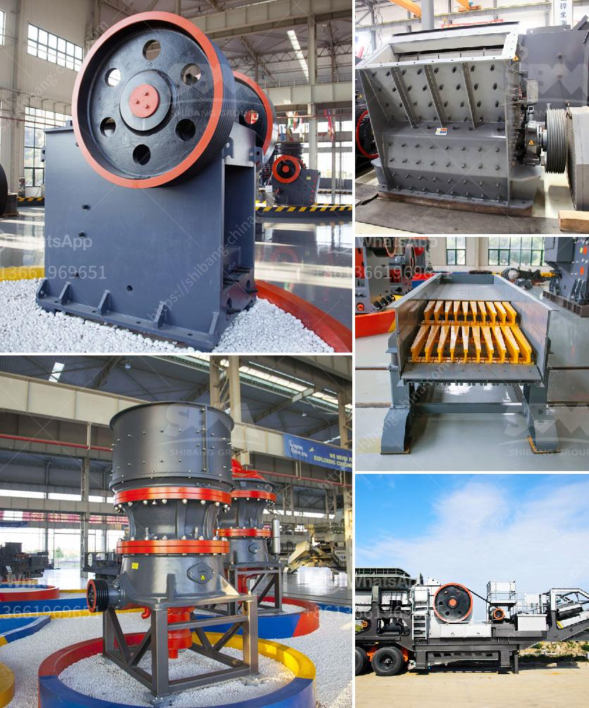

<h3>silica sand production using ball mill in dubai</h3>
Silica sand, also known as quartz sand, is a naturally occurring material widely used in various industries such as glass, ceramics, and manufacturing of construction materials. It is an essential component in the production of high-quality glass products and a key material in the manufacturing of concrete and asphalt.

Silica sand production utilizes a traditional ball mill in transforming the raw material into a finely ground powder. This process aims to ensure the optimal particle size distribution for the final application. The mill plays an important role in facilitating the chemical reaction that takes place once the silica sand is mixed with other materials, such as limestone, soda ash, and recycled glass.

The quality of the final product depends on the efficiency of the grinding process, which is highly influenced by the performance of the ball mill. To enhance this process, the ball mill is often equipped with screens to control the particle size distribution and remove impurities. This ensures that the silica sand is of the desired quality and meets the required specifications.

Dubai is one of the largest exporters of silica sand to countries worldwide. As the demand for silica sand continues to grow, the United Arab Emirates is helping to meet this demand with its production capabilities. With advanced technology and state-of-the-art equipment, the ball mill used in the production of silica sand in Dubai is of excellent quality and delivers efficient performance.

With silica sand playing a critical role in many industries, it is essential to ensure its quality and reliability. By utilizing a high-quality ball mill, Dubai can meet the growing demand for silica sand while improving the efficiency and productivity of its industrial processes. This contributes to the overall economic development of the region and strengthens its position as a global supplier of silica sand.

In conclusion, the use of a ball mill in the production of silica sand in Dubai is an efficient and reliable method for processing and refining the raw materials into fine powder. It ensures high-quality components and extremely fine and pure particles, which are utilized across various industries. With the UAE's growing demand for silica sand, this method ensures a steady supply of the material and strengthens its position as a global exporter.
<h3>Contact us</h3><ul><li><strong>Whatsapp:&nbsp;<a href="https://wa.me/8613661969651">+8613661969651</a></strong></li><li><a href="https://swt.shibang-china.com/?git&amp;zhl&amp;silica sand production using ball mill in dubai"><strong>Online Service(chat now)</strong></a></li></ul><h3>Related</h3><ul><li><a href='portable aggregate crushing plants.md'>portable aggregate crushing plants</a></li><li><a href='mobile stone crushers for sale south africa.md'>mobile stone crushers for sale south africa</a></li><li><a href='list of machinery used for open pit mining.md'>list of machinery used for open pit mining</a></li><li><a href='sample of project proposal in mining.md'>sample of project proposal in mining</a></li><li><a href='coal processing plant.md'>coal processing plant</a></li></ul>