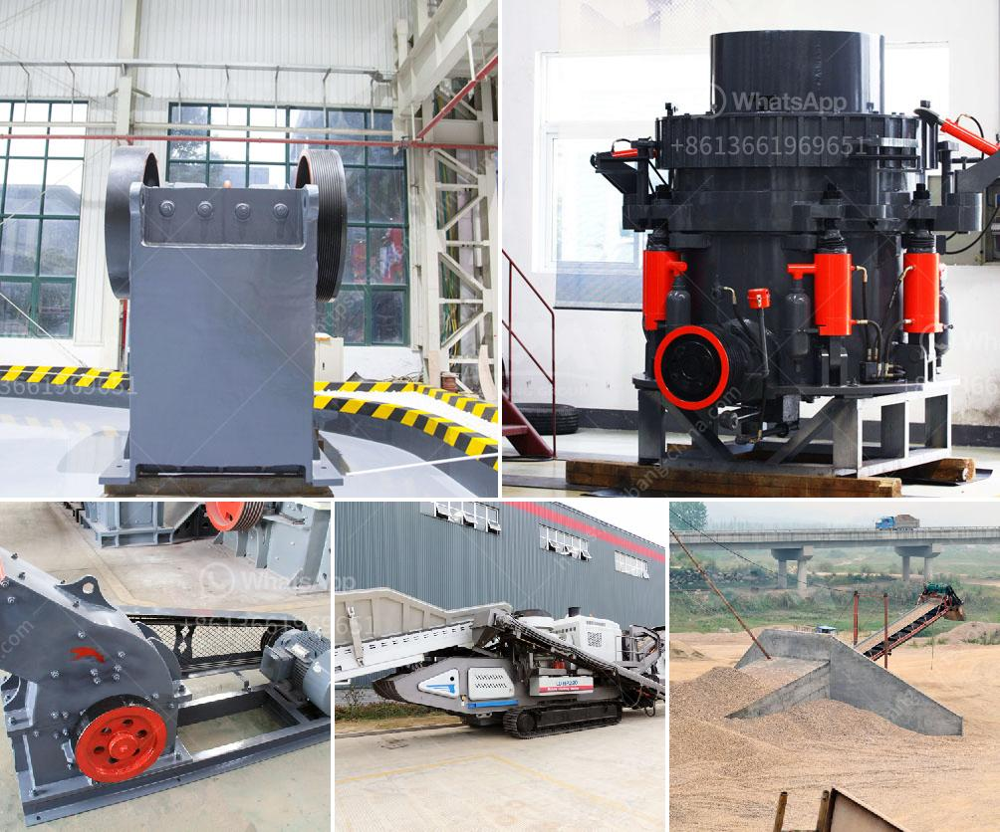

<h3>silica sand pulverizer</h3>
Silica sand is a crucial resource used in various industries such as glass manufacturing, construction, and foundry. It is abundant in nature and its high purity is sought after for its desirable physical and chemical properties. However, before it can be used in these applications, silica sand needs to go through a process called pulverization in order to reduce its particle size and improve its overall quality.

A silica sand pulverizer is a machine that is used to crush or grind silica sand for use in various applications. It can also pulverize other materials such as rock, sandstone, and minerals, which are used in industries like construction, mining, and agriculture. These machines are commonly seen at quarries and mines where raw materials are extracted and processed.

The pulverization process involves feeding the silica sand into the pulverizer's inlet hopper and then it is crushed by high-speed rotating blades. The crushed sand particles are then classified based on their size through a mesh screen. The finer particles are collected and the coarser particles are sent back into the pulverizer for further grinding. This process helps to achieve the desired particle size distribution and improve the overall quality of the silica sand.

There are several benefits to using a silica sand pulverizer. Firstly, it increases the surface area of the particles, which can enhance their reactivity in applications such as glass manufacturing or as a filler in concrete. Secondly, it ensures consistent particle size distribution, which is crucial for achieving uniformity in products like glass. Lastly, it can reduce the overall energy consumption in manufacturing processes by pulverizing the silica sand to a finer size, as smaller particles require less energy to melt or react.

In conclusion, a silica sand pulverizer is a vital machine in the silica sand processing industry. It plays a crucial role in reducing the particle size of the sand and improving its overall quality. This process enables the utilization of silica sand in various applications and industries, leading to economic and environmental benefits.
<h3>Contact us</h3><ul><li><strong>Whatsapp:&nbsp;<a href="https://wa.me/8613661969651">+8613661969651</a></strong></li><li><a href="https://swt.shibang-china.com/?git&amp;zhl&amp;silica sand pulverizer"><strong>Online Service(chat now)</strong></a></li></ul><h3>Related</h3><ul><li><a href='crushing machine pakistan.md'>crushing machine pakistan</a></li><li><a href='big stone quarry business plan pdf.md'>big stone quarry business plan pdf</a></li><li><a href='fly ash grinding machine manufacturer.md'>fly ash grinding machine manufacturer</a></li><li><a href='ball mills sizes.md'>ball mills sizes</a></li><li><a href='mining companies that sell heavy equipment.md'>mining companies that sell heavy equipment</a></li></ul>