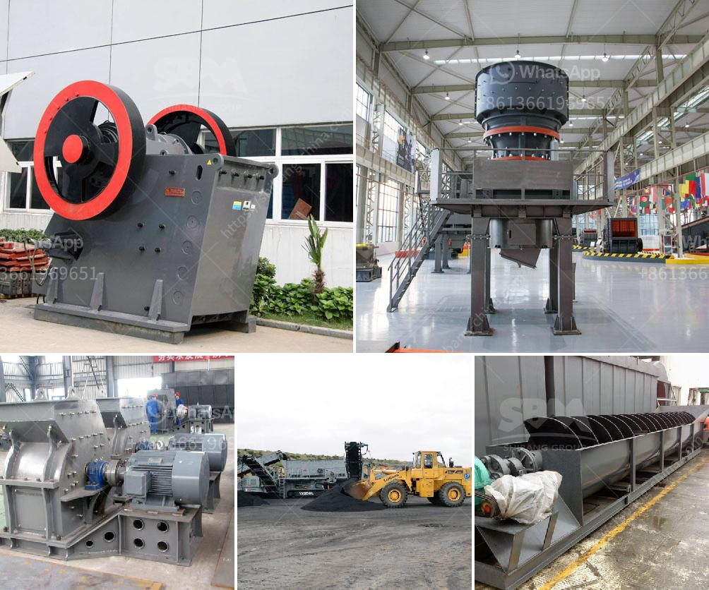

<h3>silica sand refind machines in germany</h3>
Germany is renowned for its engineering prowess and commitment to innovation. The country's machinery and equipment industry is internationally recognized for its cutting-edge technology and superior quality. When it comes to refining silica sand, Germany stands as a global leader with its state-of-the-art machines and sustainable practices.

Silica sand, also known as quartz sand, is a crucial raw material for various industries such as glass production, construction, and foundry. Its unique properties, including high purity and high heat resistance, make it in high demand worldwide. However, before it can be used in these applications, the raw silica sand must go through a refining process to remove impurities and obtain the desired quality.

In Germany, numerous companies have specialized in manufacturing silica sand refining machines that ensure the purity and quality of the final product. These machines employ advanced technologies and cutting-edge techniques to separate and purify the silica sand.

One of the primary machines used in the refining process is the silica sand attrition scrubber. This machine uses mechanical force and water to remove surface impurities and coatings from the sand grains. It works by vigorously tumbling the sand particles together, effectively breaking down any chemical bonds and releasing impurities.

Germany's silica sand refining machines also incorporate advanced flotation techniques. Flotation is a widely used method for the separation of minerals from their ores or industrial waste materials. The process involves adding specific chemicals to the silica sand, causing the impurities to become water-repellent. These impurities adhere to air bubbles, which are then skimmed off, leaving behind purified silica sand.

Furthermore, Germany's commitment to sustainability extends to the silica sand refining process. Many companies have implemented eco-friendly practices to reduce their environmental footprint. For example, the refining machines are designed to minimize water consumption and energy usage, ensuring efficient and sustainable operations.

Another aspect of sustainability in silica sand refining is recycling and reusing water during the process. Effluent water is carefully treated and recycled back into the system, minimizing the consumption of freshwater resources. This not only reduces the ecological impact but also contributes to cost reductions and overall efficiency.

Germany's silica sand refining machines prioritize automation and precision. These machines are equipped with advanced sensors and control systems that monitor and regulate critical parameters. This ensures consistent product quality and reduces the need for manual intervention or oversight.

Additionally, the production capacity of these machines is set to meet the growing demands of various industries. The machines are capable of refining large quantities of silica sand in a short span of time, contributing to timely delivery and customer satisfaction.

In conclusion, Germany has established itself as a global leader in silica sand refining machines due to its advanced technology and commitment to sustainability. The country's machinery and equipment industry continues to innovate and improve the efficiency of the refining process. By incorporating eco-friendly practices and implementing automation, Germany's silica sand refining machines strive to achieve optimal quality while minimizing their environmental impact.
<h3>Contact us</h3><ul><li><strong>Whatsapp:&nbsp;<a href="https://wa.me/8613661969651">+8613661969651</a></strong></li><li><a href="https://swt.shibang-china.com/?git&amp;zhl&amp;silica sand refind machines in germany"><strong>Online Service(chat now)</strong></a></li></ul><h3>Related</h3><ul><li><a href='small ball mill for cement clinker grinding india.md'>small ball mill for cement clinker grinding india</a></li><li><a href='graphite mining equipment.md'>graphite mining equipment</a></li><li><a href='price of plants crushing.md'>price of plants crushing</a></li><li><a href='small ball mill price.md'>small ball mill price</a></li><li><a href='grinding machine capacity 1tph stone crusher machine.md'>grinding machine capacity 1tph stone crusher machine</a></li></ul>