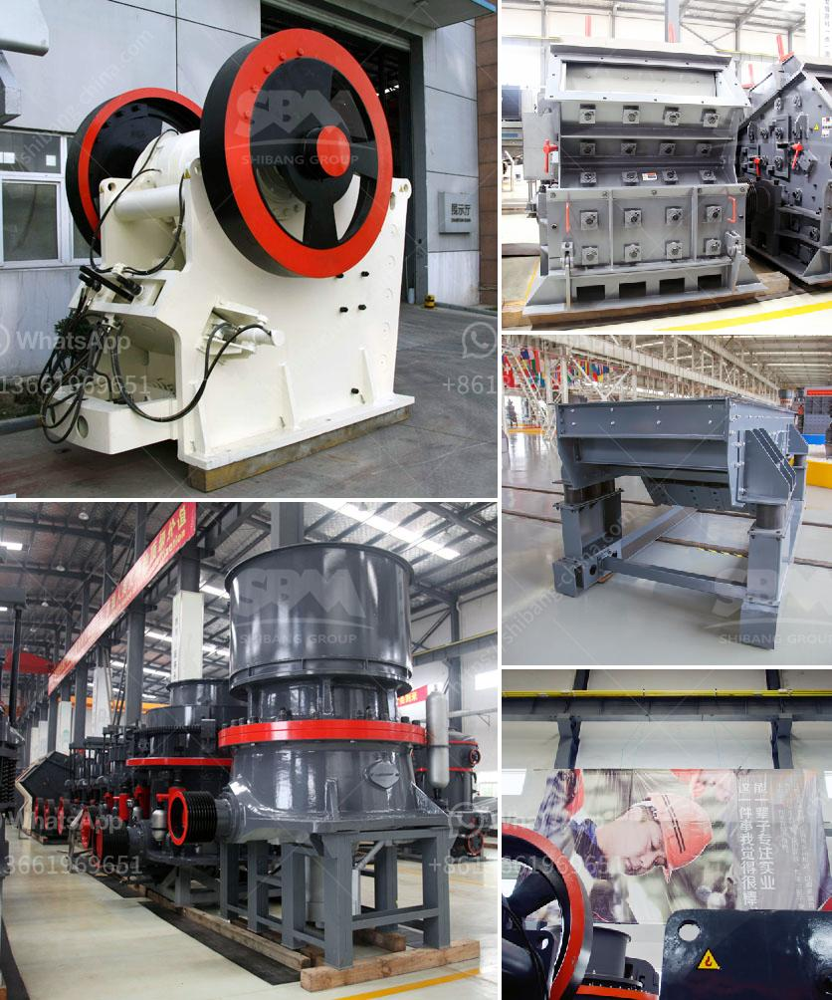

<h3>silica sand washing plant in malaysia</h3>
Silica sand washing plant in Malaysia is a leading producer and supplier of high-quality silica sand to various industries. With years of experience and extensive knowledge in the field of mining and mineral processing, we are proud to have developed ourselves as a leading manufacturer and supplier of a wide range of silica sand washing and beneficiation plant machinery.

Silica sand is a type of sand that contains high levels of silica or silicon dioxide. It is used for a wide range of applications, such as glass making, water filtration, industrial casting, sandblasting, and hydraulic fracturing. This high-purity silica sand is essential for many industries, as it is a primary raw material in their manufacturing processes.

One of the key challenges faced by the silica sand industry in Malaysia is the high content of iron impurities in the raw material, which reduces the silica content and quality of the final product. To address this issue, we have invested in a silica sand washing plant, which uses advanced technology to remove these impurities and improve the silica content, resulting in high-quality silica sand.

Our washing plant includes a series of equipment, including vibrating screens, hydrocyclones, attrition scrubbers, spiral classifiers, and dewatering screens. These machines work together to remove impurities and achieve the desired silica sand specifications. The vibrating screens classify the silica sand particles, and the hydrocyclones and attrition scrubbers remove the impurities, such as clay and iron oxides, through a process called particle separation.

The spiral classifiers help in removing the finer particles, while the dewatering screens ensure that the washed silica sand has the appropriate moisture content for various applications. This highly efficient washing plant not only improves the quality of the silica sand but also reduces the environmental impact by minimizing water and energy consumption.

Our silica sand washing plant in Malaysia is capable of processing a wide range of silica sand grades and producing high-purity silica sand products. We cater to the demands of various industries, including glass, foundry, ceramics, construction, chemicals, and filtration. Our silica sand washing plant is designed to be highly flexible and versatile, ensuring convenient operation and easy maintenance.

We take pride in our ability to provide customized solutions to meet the specific requirements of our clients. Our professional team works closely with customers to understand their needs and deliver tailored solutions that ensure the highest quality of silica sand products.

In conclusion, our silica sand washing plant in Malaysia is a highly efficient and versatile system that produces high-quality silica sand products. We are proud to have established ourselves as a leading manufacturer and supplier of silica sand washing and beneficiation plant machinery in Malaysia. If you are interested in our products or have any questions, please feel free to contact us.
<h3>Contact us</h3><ul><li><strong>Whatsapp:&nbsp;<a href="https://wa.me/8613661969651">+8613661969651</a></strong></li><li><a href="https://swt.shibang-china.com/?git&amp;zhl&amp;silica sand washing plant in malaysia"><strong>Online Service(chat now)</strong></a></li></ul><h3>Related</h3><ul><li><a href='crusher hydroponic cone crusher.md'>crusher hydroponic cone crusher</a></li><li><a href='concrete mobile crusher for rent in usa.md'>concrete mobile crusher for rent in usa</a></li><li><a href='small ball grinding machine.md'>small ball grinding machine</a></li><li><a href='process of raw mill.md'>process of raw mill</a></li><li><a href='advantage of wet grinding in cement manufacturing.md'>advantage of wet grinding in cement manufacturing</a></li></ul>