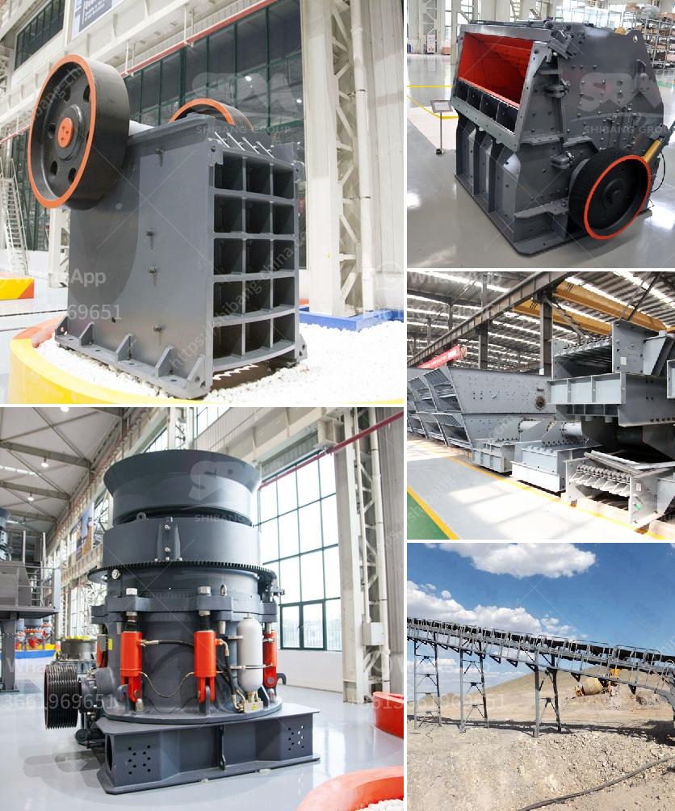

<h3>silica sand washing purification</h3>
Silica sand is a commonly used material in various industries, including construction, glass manufacturing, foundries, and water filtration systems. The widespread usage of this versatile material has increased the demand for high-quality silica sand, which can be achieved through a process called washing and purification.

Silica sand washing and purification involve removing small and large impurities from the sand to make it suitable for further use. This process includes scrubbing the sand particles, sorting, and removing any silt, clay, iron, or other minerals present in the sand. The ultimate goal is to produce high-purity silica sand with low levels of impurities.

The washing and purification process begins with the silica sand being fed into a vibrating screen for size classification. The sand particles are then washed and scrubbed using water and a mechanical agitation process. This helps to remove any foreign particles, such as clay, silt, or organic matter. The agitation process also assists in breaking down any undesirable mineral deposits that may be attached to the silica sand particles.

After the initial scrubbing process, the silica sand is subjected to further classification to separate the different-sized particles. This is typically done through hydrocyclones or spiral classifiers, which use centrifugal force to separate the sand particles based on their size and density. This step ensures that only the desired size fractions are retained, further enhancing the quality of the silica sand.

Once the washing and classification processes are complete, the silica sand undergoes a series of additional steps to remove any remaining impurities. These steps may include acid leaching, attrition scrubbing, or magnetic separation techniques, depending on the specific requirements of the silica sand application.

The final product obtained after silica sand washing and purification is a high-quality and versatile material suitable for use in various industries. It is characterized by its low levels of impurities, high silica content, and consistent particle size distribution. This high-quality silica sand is also used as a key ingredient in the production of glass, ceramics, and metal casting molds.

In conclusion, silica sand washing and purification is a crucial process that ensures the production of high-quality silica sand with excellent purity and consistency. Through a combination of mechanical and chemical processes, impurities are removed, resulting in a versatile raw material that is indispensable in numerous industries.
<h3>Contact us</h3><ul><li><strong>Whatsapp:&nbsp;<a href="https://wa.me/8613661969651">+8613661969651</a></strong></li><li><a href="https://swt.shibang-china.com/?git&amp;zhl&amp;silica sand washing purification"><strong>Online Service(chat now)</strong></a></li></ul><h3>Related</h3><ul><li><a href='flowchart diagram for cement plant.md'>flowchart diagram for cement plant</a></li><li><a href='stone crusher plant made in pakistan price.md'>stone crusher plant made in pakistan price</a></li><li><a href='grinding machine for marble.md'>grinding machine for marble</a></li><li><a href='industrial application ball mill.md'>industrial application ball mill</a></li><li><a href='jaw crusher indonesia agent.md'>jaw crusher indonesia agent</a></li></ul>