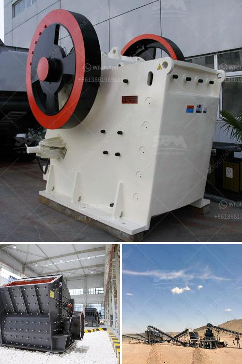

<h3>single stage crusher price list in south africa</h3>
Single stage crusher is developed based on years of research and experience. It can be widely used in metallurgy, mining, chemical industry, cement, coal gangue, construction, sand, refractory materials, ceramic and other industries, processing raw materials at one time. In recent years, with the enhancement of infrastructure construction, the demand for construction aggregates is also increasing. The single-stage crusher has been favored by more and more customers due to its own advantages.

The price of single stage crusher is not fixed, and the range of processing capacity per hour is large, which can better meet the needs of different users. As a professional manufacturer of single stage crusher, Zhengzhou HXJQ has summarized the common problems encountered by users in the purchase process.

Firstly, users often hesitate when choosing a single stage crusher, comparing with multi-stage crusher. On the one hand, multi-stage crusher adopts three-stage crushing process, which not only crushes waste materials but also improves production efficiency, making the production costs more affordable. On the other hand, single-stage crusher is cheaper than the multi-stage one. However, the single-stage crusher has a large energy consumption and low production efficiency, so it is only suitable for crushing materials with medium hardness and low water content.

Secondly, the price of single stage crusher varies greatly in the market. Different manufacturers have different production processes, equipment quality, and after-sales service, resulting in different prices. Therefore, users should comprehensively consider various factors when purchasing, such as the reputation and strength of the manufacturer, equipment performance and quality, and service guarantee.

In conclusion, when purchasing a single stage crusher in South Africa, it is better to shop around and compare multiple manufacturers' prices. Successive negotiations are essential in the process. The specific price is determined based on factors such as product model, size, and customer demand.
<h3>Contact us</h3><ul><li><strong>Whatsapp:&nbsp;<a href="https://wa.me/8613661969651">+8613661969651</a></strong></li><li><a href="https://swt.shibang-china.com/?git&amp;zhl&amp;single stage crusher price list in south africa"><strong>Online Service(chat now)</strong></a></li></ul><h3>Related</h3><ul><li><a href='used raymond mills barite raymond mill.md'>used raymond mills barite raymond mill</a></li><li><a href='crusher for construction price.md'>crusher for construction price</a></li><li><a href='ton hour coal crusher and screen.md'>ton hour coal crusher and screen</a></li><li><a href='second hand stone production line for.md'>second hand stone production line for</a></li><li><a href='china dahua series jaw crusher.md'>china dahua series jaw crusher</a></li></ul>