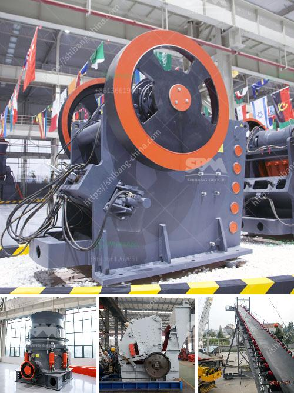

<h3>slag ball mill crusher</h3>
Slag is a byproduct of industrial waste generated during the smelting process. It is a mineral material that is produced as a result of melting iron and other metals in a blast furnace. Slag is formed when impurities in the molten metal mix with fluxes and oxidize, creating waste material that needs to be disposed of.

However, slag has also found a valuable application in various industries. One of the most notable uses of slag is in the construction industry, where it is used as an aggregate in concrete. The use of slag in concrete not only enhances its strength and durability but also reduces its environmental impact.

To effectively utilize slag in various industries, it needs to be processed into a fine powder form. This is where a slag ball mill crusher comes into play. A slag ball mill crusher consists of a drum with a fixed and a rotating part that crushes the slag chunks into finer pieces. The finer the particles, the more efficient the slag ball mill crusher becomes.

The slag can be fed into the slag ball mill crusher continuously and evenly through the conveyor belt or vibrating feeder. The crushed slag particles are then discharged through the grid plate and transported to the subsequent process by the conveyor belt.

There are several advantages to using a slag ball mill crusher. Firstly, the slag particles are uniformly crushed into smaller and more regular shapes, which allows for the easy separation of metal impurities from the slag material. Secondly, the use of a slag ball mill crusher reduces the wear and tear on the device and prolongs its service life. Thirdly, the slag ball mill crusher is designed with an integrated adjusting device, allowing for easy control and regulation of the size of the crushed slag particles.

The slag ball mill crusher has a unique design, which simplifies the crushing process and efficiently crushes the slag material into smaller pieces. The crusher can be used for both wet and dry crushing, making it a highly versatile machine. Additionally, the slag mill crusher is environmentally friendly, reducing pollution caused by the waste material.

In conclusion, the slag ball mill crusher is a highly efficient crushing equipment that is used to crush and grind raw materials for various industries. With its unique design, it simplifies the crushing process and enhances the efficiency of the crusher. The slag ball mill crusher offers numerous advantages, including high crushing capacity, adjustable output size, and environmental friendliness. With its wide range of applications, the slag ball mill crusher is an indispensable piece of equipment in various industries.
<h3>Contact us</h3><ul><li><strong>Whatsapp:&nbsp;<a href="https://wa.me/8613661969651">+8613661969651</a></strong></li><li><a href="https://swt.shibang-china.com/?git&amp;zhl&amp;slag ball mill crusher"><strong>Online Service(chat now)</strong></a></li></ul><h3>Related</h3><ul><li><a href='cost of setting up a quarry crusher plant.md'>cost of setting up a quarry crusher plant</a></li><li><a href='latest three roll mills.md'>latest three roll mills</a></li><li><a href='desain gambar vibrating screen 100ton jam.md'>desain gambar vibrating screen 100ton jam</a></li><li><a href='wet ground mica powder mill equipment supplier.md'>wet ground mica powder mill equipment supplier</a></li><li><a href='mineral grinding mill machine used for sale uk.md'>mineral grinding mill machine used for sale uk</a></li></ul>