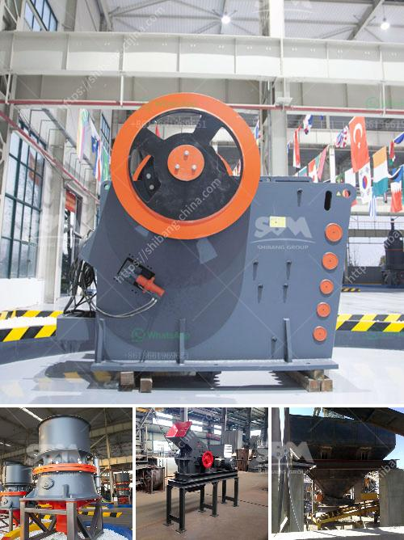

<h3>slag crusher machine</h3>
Slag, a byproduct of steel production, is a material that is often discarded due to its limited applications. However, with the innovation of slag crusher machines, industries and companies are now able to efficiently recycle this seemingly useless material.

Slag crushers are designed to reduce large chunks of slag into smaller pieces. These machines work by crushing the material with heavy, rotating blades, as the material passes through the machine. This process not only reduces the size of the slag, but also releases any trapped metal, allowing it to be easily separated and recycled.

The benefits of using slag crusher machines are numerous. Firstly, it allows for the efficient disposal of slag waste, which ultimately reduces the overall cost of production. Instead of paying for the disposal of this waste material, companies can now extract valuable metals from the slag and sell them, turning what was once considered waste into a profitable resource.

Secondly, the use of slag crusher machines also helps to protect the environment. By recycling the slag, companies are reducing the need for mining and extraction of natural resources. This not only conserves precious resources but also reduces the environmental damage caused by such activities.

Furthermore, the use of slag crusher machines also helps to reduce greenhouse gas emissions. Manufacturing new steel products from raw materials requires a significant amount of energy, which in turn leads to the release of greenhouse gases. By recycling slag and using it in the production of new steel, companies are able to reduce their carbon footprint and contribute to a more sustainable future.

In conclusion, slag crusher machines have revolutionized the way industries and companies handle slag waste. By efficiently crushing and recycling the material, these machines not only save money but also help to protect the environment and reduce greenhouse gas emissions. The utilization of slag as a valuable resource has the potential to change the landscape of various industries, creating a more sustainable and environmentally friendly future.
<h3>Contact us</h3><ul><li><strong>Whatsapp:&nbsp;<a href="https://wa.me/8613661969651">+8613661969651</a></strong></li><li><a href="https://swt.shibang-china.com/?git&amp;zhl&amp;slag crusher machine"><strong>Online Service(chat now)</strong></a></li></ul><h3>Related</h3><ul><li><a href='crusher plant price pakistan.md'>crusher plant price pakistan</a></li><li><a href='vertical mill for.md'>vertical mill for</a></li><li><a href='crusher industrial jaw crusher information.md'>crusher industrial jaw crusher information</a></li><li><a href='crushing plant in the philippines.md'>crushing plant in the philippines</a></li><li><a href='vibrating feeder vs belt conveyor.md'>vibrating feeder vs belt conveyor</a></li></ul>