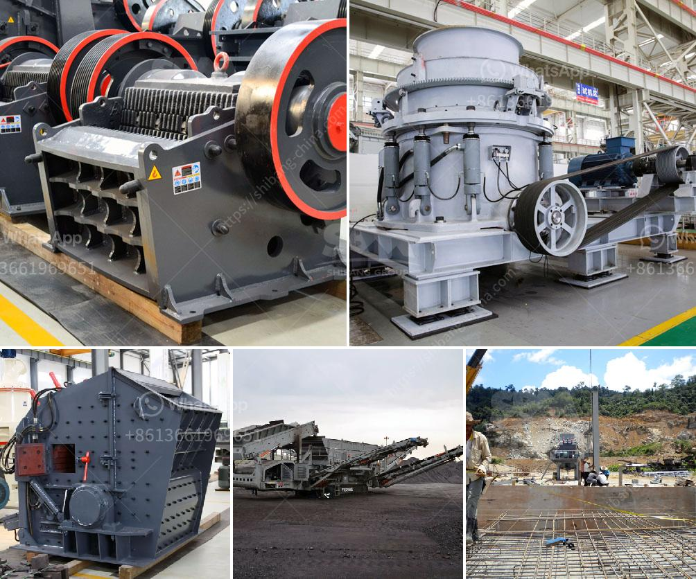

<h3>slag grinding process</h3>
Slag is a byproduct generated during the manufacturing of pig iron and steel. It is a granular material that is highly porous and glassy in nature. Traditionally, it was considered a waste material and was disposed of in landfills. However, with the advancements in technology and the increasing awareness about sustainable practices, slag has found new utility in various industries.

One such application of slag is in the construction industry, where it is used as a partial replacement for cement in the production of concrete. However, before it can be used effectively, slag needs to undergo a grinding process to remove impurities and enhance its performance.

The slag grinding process involves drying, grinding, sieving, and bagging the material. The company that is supplying the slag usually provides the drying equipment, grinding equipment, and bagging equipment. The process begins with drying the slag, which usually involves either a rotary or vertical drying machine. This step is crucial as it helps in reducing the moisture content of the slag and making it suitable for further processing.

Once the slag is dried, it is sent to the grinding mill, where it is ground into a fine powder. The grinding mill used depends on the specific slag characteristics and desired end product specifications. The most common type of grinding mill used for this purpose is a ball mill.

After grinding, the slag powder is sieved through a vibrating screen, and any oversized particles are returned to the grinding mill for further processing. The sieved slag powder is then collected in bags and stored for use or transportation.

The slag grinding process offers numerous benefits. It not only reduces the waste generated during the manufacturing process but also provides a sustainable alternative to traditional cement production. Additionally, slag has been found to enhance the performance of concrete by improving its durability, resistance to chemical attack, and reducing the heat of hydration.

In conclusion, the slag grinding process plays a crucial role in transforming waste slag into a valuable material with wide-ranging applications. It not only helps in reducing environmental impact but also contributes to the sustainable development of various industries, particularly construction. With further research and innovation, the potential of slag as a substitute material is expected to grow, leading to a more sustainable and eco-friendly future.
<h3>Contact us</h3><ul><li><strong>Whatsapp:&nbsp;<a href="https://wa.me/8613661969651">+8613661969651</a></strong></li><li><a href="https://swt.shibang-china.com/?git&amp;zhl&amp;slag grinding process"><strong>Online Service(chat now)</strong></a></li></ul><h3>Related</h3><ul><li><a href='stone crusher plant cost in saudi.md'>stone crusher plant cost in saudi</a></li><li><a href='stone crusher mills in mercadolibre.md'>stone crusher mills in mercadolibre</a></li><li><a href='crusher equipment supplier.md'>crusher equipment supplier</a></li><li><a href='how to calculate the operating cost of a stone crusher.md'>how to calculate the operating cost of a stone crusher</a></li><li><a href='barite mill specifications.md'>barite mill specifications</a></li></ul>