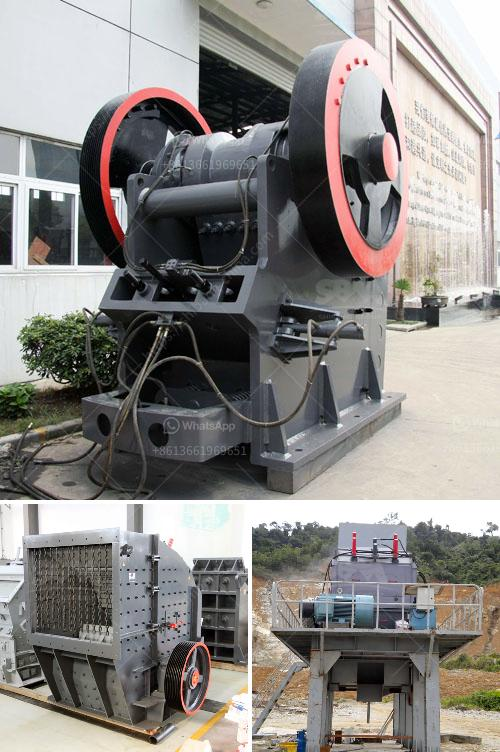

<h3>slag powder grinding in india</h3>
Slag powder grinding is an essential process in India's steel industry. It contributes to the overall production efficiency of steel plants and helps to reduce environmental pollution. The grinding process efficiently separates the metallic and non-metallic components, allowing the recovery and reuse of valuable materials. This article will discuss the importance of slag powder grinding in India and the various benefits it offers.

India is one of the world's largest producers of steel, with a growing demand for high-quality products. Steel manufacturing involves the production of steel from iron ore and scrap metal, which generates large quantities of waste material known as slag. Slag is a by-product of the steel-making process and consists of silicon dioxide, calcium oxide, iron oxide, and other impurities. Disposing of slag can be expensive and harmful to the environment due to its high alkalinity and heavy metal content.

To manage this waste material effectively, the steel industry in India has adopted slag powder grinding as a sustainable solution. Slag powder grinding refers to the process of finely grinding slag particles into a fine powder, which can then be utilized in various applications. The grinding process involves crushing, drying, and grinding the slag to the desired fineness, and then separating and collecting the powder.

One of the primary benefits of slag powder grinding is its environmental impact. By grinding slag into a fine powder, the steel industry can reduce the amount of waste sent to landfills. This helps conserve natural resources and minimize greenhouse gas emissions associated with the production of cement, as slag powder can be used as a substitute for cement in concrete production. The use of slag powder in concrete can enhance its durability, strength, and resistance to chemical attack.

Furthermore, slag powder grinding promotes resource conservation and reduces the extraction of raw materials. It allows the recovery of valuable metallic components such as iron and steel, which can be reused in the production process. This not only reduces the dependency on virgin materials but also helps in cost reduction and energy conservation. The recovered metallic components can be processed and sold as valuable products, generating additional revenue for the steel industry.

Apart from environmental benefits, slag powder grinding also offers economic advantages. The use of slag powder in construction materials reduces the overall cost of construction, as it is more affordable than traditional cement. This makes it an attractive option for infrastructure projects in India, allowing for savings in construction expenses while maintaining high-quality standards. Additionally, the sale of recovered metallic components adds to the industry's revenue stream, contributing to its economic growth.

In conclusion, slag powder grinding plays a vital role in India's steel industry, ensuring the efficient utilization of waste materials and reducing environmental pollution. The process helps in the recovery and reuse of valuable metallic components and promotes resource conservation. Moreover, using slag powder in construction materials offers economic advantages by reducing construction costs and generating additional revenue. The adoption of slag powder grinding in India reflects the industry's commitment to sustainability and responsible waste management.
<h3>Contact us</h3><ul><li><strong>Whatsapp:&nbsp;<a href="https://wa.me/8613661969651">+8613661969651</a></strong></li><li><a href="https://swt.shibang-china.com/?git&amp;zhl&amp;slag powder grinding in india"><strong>Online Service(chat now)</strong></a></li></ul><h3>Related</h3><ul><li><a href='vibrating screen indonesia.md'>vibrating screen indonesia</a></li><li><a href='ceramic crusher machine.md'>ceramic crusher machine</a></li><li><a href='stone crusher machines manufactures in china.md'>stone crusher machines manufactures in china</a></li><li><a href='price stone crusher in nigeria.md'>price stone crusher in nigeria</a></li><li><a href='crushing machine pakistan.md'>crushing machine pakistan</a></li></ul>