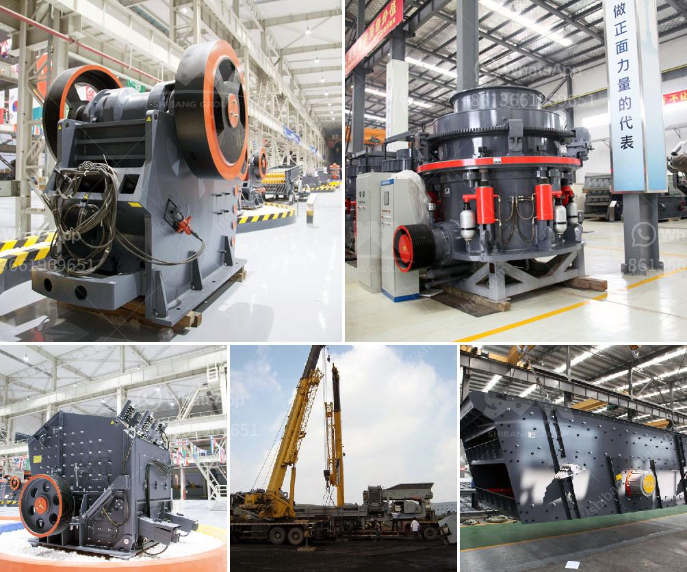

<h3>small 100 ton rock crushing machine</h3>
When it comes to the world of heavy machinery, there are few as impressive as the 100-ton rock crushing machine. Despite its enormous size, this machine has the ability to crush rocks into smaller fragments, making it a vital tool for various industries such as construction, mining, and recycling. In this article, we will explore the features and applications of this mechanical marvel and shed light on how it continues to revolutionize these industries.

The small 100-ton rock crushing machine consists of several key components, each designed to maximize its efficiency and power. Firstly, a heavy-duty steel frame provides a solid foundation for the entire machine. Additionally, the machine is equipped with large metal jaws or plates that exert immense force on the rocks, breaking them down into more manageable sizes.

The crushing process begins with rocks being fed into the machine through a hopper, which acts as a loading point. The rocks are then guided towards the jaws, where an intense compression force is applied. This force expels the energy necessary to break down the rock, ensuring its conversion into smaller, usable fragments.

The power and versatility of the 100-ton rock crushing machine make it an invaluable asset for various sectors. In construction, it is used for crushing large rocks into specific sizes suitable for further processing, such as road base material or concrete aggregate. The mining industry also benefits from this machine as it helps extract valuable minerals from mountains and underground deposits. Furthermore, the machine aids in recycling processes by breaking down concrete, asphalt, and other materials, allowing them to be reused.

The 100-ton rock crushing machine boasts high efficiency, making it a cost-effective solution for businesses. By reducing large rocks into smaller fragments, transportation costs are significantly decreased. Further, the crushed rock can be repurposed, reducing the need to purchase additional raw materials. These factors combine to make the machine an excellent investment for companies seeking improved productivity and profitability.

It is essential to address the environmental implications of using such a machine. The extraction and crushing processes of rocks can result in dust and noise pollution. However, advancements in technology have led to the inclusion of measures to minimize these effects. For instance, dust collection systems are often incorporated to capture particles during the crushing process, reducing airborne emissions. Additionally, soundproofing measures help mitigate noise pollution, promoting a safer and more sustainable work environment.

The small 100-ton rock crushing machine stands as a testament to human ingenuity and engineering marvels. Despite its colossal size, this machine has the capability to crush rocks into smaller fragments, serving various industries such as construction, mining, and recycling. Its efficiency, cost-effectiveness, and versatility have made it an indispensable tool for businesses worldwide. Moreover, with ongoing advancements in technology, the machine continues to evolve, aiming to further minimize environmental impacts. As we appreciate the power and capabilities of this impressive machine, let us also remain conscious of our responsibility to harness its benefits while safeguarding the planet.
<h3>Contact us</h3><ul><li><strong>Whatsapp:&nbsp;<a href="https://wa.me/8613661969651">+8613661969651</a></strong></li><li><a href="https://swt.shibang-china.com/?git&amp;zhl&amp;small 100 ton rock crushing machine"><strong>Online Service(chat now)</strong></a></li></ul><h3>Related</h3><ul><li><a href='mobile crusher sale germany.md'>mobile crusher sale germany</a></li><li><a href='stone crusher to diessel.md'>stone crusher to diessel</a></li><li><a href='iron ore heavy duty equipments with photos.md'>iron ore heavy duty equipments with photos</a></li><li><a href='pe 200 x 300 stone crusher.md'>pe 200 x 300 stone crusher</a></li><li><a href='stone for stone mill.md'>stone for stone mill</a></li></ul>