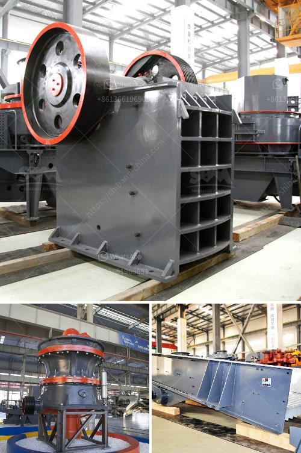

<h3>small ball grinding machine</h3>
Small ball grinding machines are compact devices that are used to grind small-sized balls. They are commonly used in laboratories and small-scale manufacturing operations for grinding materials such as ceramics, chemicals, or metallic alloys.

One of the key advantages of small ball grinding machines is their size. They are designed to be compact and lightweight, making them easy to transport and store. This makes them ideal for use in small workshops or laboratories where space may be limited.

Despite their small size, these machines offer exceptional grinding capabilities. They are equipped with high-quality grinding wheels that can effectively grind and shape small-sized balls. The precise grinding action of these machines ensures that the balls have a smooth surface finish and accurate dimensions.

Another advantage of small ball grinding machines is their versatility. They can be used to grind a wide range of materials, including metals, ceramics, and chemicals. This makes them suitable for various applications, such as grinding samples for analysis in a laboratory or producing small-sized balls for specialized manufacturing processes.

Additionally, small ball grinding machines are designed with user-friendly features. They are typically equipped with controls that are easy to understand and operate. This makes it convenient for operators to set and adjust the grinding parameters according to their specific requirements.

In conclusion, small ball grinding machines are compact, versatile, and efficient tools for grinding small-sized balls. Their size and portability make them suitable for use in cramped spaces, such as laboratories or small workshops. Additionally, they offer exceptional grinding capabilities and are easy to operate. Whether it is for scientific research or small-scale manufacturing, these machines are a valuable asset.
<h3>Contact us</h3><ul><li><strong>Whatsapp:&nbsp;<a href="https://wa.me/8613661969651">+8613661969651</a></strong></li><li><a href="https://swt.shibang-china.com/?git&amp;zhl&amp;small ball grinding machine"><strong>Online Service(chat now)</strong></a></li></ul><h3>Related</h3><ul><li><a href='calcium carbonate manufacturing plant.md'>calcium carbonate manufacturing plant</a></li><li><a href='static jaw crusher.md'>static jaw crusher</a></li><li><a href='granite and marble factory for sale.md'>granite and marble factory for sale</a></li><li><a href='cost for starting a granite manufacturing.md'>cost for starting a granite manufacturing</a></li><li><a href='mining crusher plants in egypt.md'>mining crusher plants in egypt</a></li></ul>