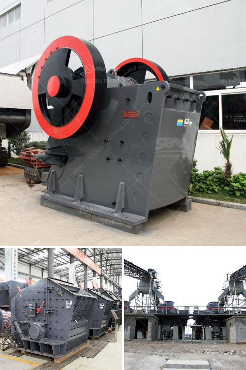

<h3>small ball mill for alumina</h3>
The small ball mill for alumina is a versatile milling device capable of grinding and mixing different materials. It is commonly used in the production of ceramics, paints, ores, and other types of materials. This article will provide an overview of the small ball mill for alumina and its uses in various industries.

The small ball mill for alumina operates on the principle of impact and attrition. The cylindrical vessel contains grinding media such as steel balls or ceramic beads. When the mill rotates, the grinding media is lifted to a certain height and then dropped or thrown off, causing the material inside to be reduced in size. The size of the material is determined by the size and speed of the grinding media, as well as the duration of milling.

One of the primary uses of the small ball mill for alumina is in the ceramics industry. In the production of ceramic tiles, the raw materials undergo a grinding process to reduce their particle size. The small size of the alumina ball mill makes it a suitable choice for this application. By grinding the raw materials to a fine powder, the ceramic tiles exhibit enhanced properties such as higher strength, improved aesthetics, and better dimensional accuracy.

Additionally, the small ball mill for alumina is also used in the paint industry. Paints consist of pigments, binders, solvents, and additives. These components are thoroughly mixed in the ball mill, resulting in a homogenous paint formulation. The small size and versatility of the ball mill make it an ideal choice for the development and testing of new paint formulations. By adjusting the milling parameters, such as the speed and duration, the manufacturers can optimize the paint's consistency, color, and performance.

Furthermore, the small ball mill for alumina finds its application in the processing of ores. In the mining industry, ores are typically subjected to milling operations to extract valuable minerals. The small ball mill can grind the ore to a fine powder, allowing for easier recovery of valuable minerals through subsequent processes such as flotation or leaching. By adjusting the milling parameters, the operators can optimize the grinding process to achieve the desired particle size distribution, which is critical for efficient mineral separation.

In conclusion, the small ball mill for alumina is a versatile milling device that finds its application in various industries, including ceramics, paints, and mining. Its ability to grind and mix different materials makes it an essential tool for manufacturers and researchers. The efficiency and effectiveness of the grinding process depend on various factors such as the size and speed of the grinding media, as well as the duration of milling. With advancements in technology, there is a continuous improvement in the design and performance of small ball mills, allowing for better control and precision in the milling process.
<h3>Contact us</h3><ul><li><strong>Whatsapp:&nbsp;<a href="https://wa.me/8613661969651">+8613661969651</a></strong></li><li><a href="https://swt.shibang-china.com/?git&amp;zhl&amp;small ball mill for alumina"><strong>Online Service(chat now)</strong></a></li></ul><h3>Related</h3><ul><li><a href='jaw crusher for sale in spain.md'>jaw crusher for sale in spain</a></li><li><a href='equipment for quarry.md'>equipment for quarry</a></li><li><a href='m sand crusher in tirunelveli.md'>m sand crusher in tirunelveli</a></li><li><a href='grinding machine palletsgrinding machine palvisor.md'>grinding machine palletsgrinding machine palvisor</a></li><li><a href='manufacturer jaw crusher.md'>manufacturer jaw crusher</a></li></ul>