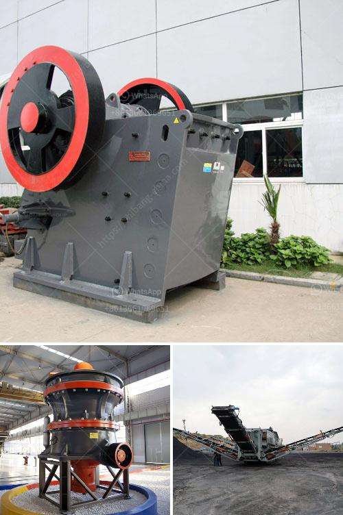

<h3>small ball mill for cement clinker grinding india</h3>
A ball mill is a type of grinder used to grind materials into extremely fine powder for use in mineral dressing processes, paints, pyrotechnics, ceramics, and selective laser sintering. The ball mill is a key piece of equipment for grinding crushed materials, and it is widely used in production lines for powders such as cement, silicates, refractory material, fertilizer, glass ceramics, etc. as well as for ore dressing of both ferrous and non-ferrous metals. 

India is the second largest producer of cement in the world, and it operates on a very significant scale, producing over 7% of the global installed capacity. Cement companies in India contribute to each other's global reach, with both exports and imports of clinker and cement increasing substantially. 

To cater to the ever-increasing demand for cement, many cement manufacturers are investing in small ball mill units for cement clinker grinding. This recent market trend has encouraged cement companies to focus on smaller capacities, with around 100-300 tons per day being the typical size of small ball mills.

Small ball mills are widely used in the cement industry for clinker grinding. They have the advantage of quick installation and relatively simple operation. Compared to large scale ball mills, small ball mills can accomplish the same grinding job more efficiently, with less energy consumption.

1. Raw materials properties: The grindability of the raw material affects the size and energy requirement of the mill. 

2. Clinker hardness: The harder the clinker, the longer it takes to grind and the more energy is required. 

3. Mill speed and diameter: Higher mill speeds and smaller mill diameters result in finer grinding of the clinker. 

In conclusion, small ball mills are an efficient and cost-effective solution for cement manufacturers in India looking to reduce their energy consumption and production costs. With capacities ranging from 100 to 300 tons per day, these mills are becoming increasingly popular in the cement industry. By investing in smaller units, cement manufacturers can achieve the same grinding results while optimizing their overall production process.
<h3>Contact us</h3><ul><li><strong>Whatsapp:&nbsp;<a href="https://wa.me/8613661969651">+8613661969651</a></strong></li><li><a href="https://swt.shibang-china.com/?git&amp;zhl&amp;small ball mill for cement clinker grinding india"><strong>Online Service(chat now)</strong></a></li></ul><h3>Related</h3><ul><li><a href='roller crusher price list.md'>roller crusher price list</a></li><li><a href='barite washing equipment.md'>barite washing equipment</a></li><li><a href='gold mobile crushing equipment.md'>gold mobile crushing equipment</a></li><li><a href='rent a conveyor belt.md'>rent a conveyor belt</a></li><li><a href='chinese aggregate crusher suppliers.md'>chinese aggregate crusher suppliers</a></li></ul>