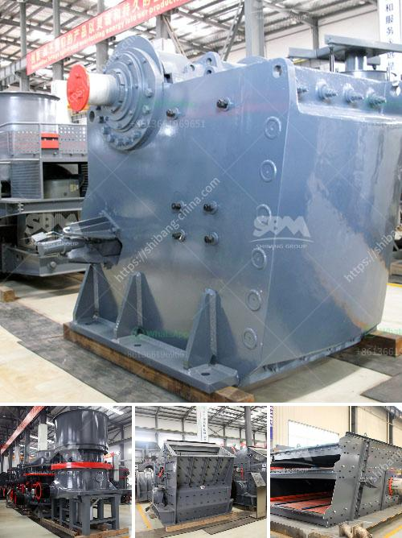

<h3>small ball mill price</h3>
With the increase in demand for fine powder products in the market, ball mill equipment with high output and low energy consumption has gradually become a favorite for many users. However, when purchasing the equipment, a lot of customers will ask about the price behind the ball mill. In fact, many factors can affect the price of the equipment, such as the manufacturer, equipment model, production cost, etc. So what is the price of a small ball mill?

First of all, we need to understand that the price of a small ball mill is affected by several factors:

1. Type of manufacturer: The market is filled with various ball mill manufacturers, each with different price positioning and marketing strategies. Based on this, the prices of the equipment they produce will vary to some extent. Therefore, when choosing a ball mill manufacturer, users should comprehensively consider the credibility, reputation, and comprehensive strength of the manufacturer, ensuring the equipment quality and after-sales service while considering the price.

2. Model of the equipment: Different models of ball mills have different prices due to differences in parameters, performance, and processing capacity. Generally speaking, smaller models have lower prices, while larger models have higher prices. Therefore, users need to consider their own production needs when choosing the equipment model, striking a balance between price and performance.

3. Production cost: In addition to the factors related to the manufacturers and equipment models, the production cost of the equipment itself will also affect its price. For example, the purchase cost of raw materials, the manufacturing cost of equipment components, the transportation cost, and the labor cost during the assembly process will all have an impact on the final price of the equipment.

The price range of small ball mill varies from dozens of thousands to hundreds of thousands. It depends on the specific production requirements of users and the selection of equipment model. The input cost of the manufacturer also varies. Therefore, when choosing a ball mill, users must have a comprehensive understanding of the price and choose a cost-effective equipment supplier.

As a professional manufacturer of ball mills, Fote Machinery has conducted in-depth research on the characteristics of various ores, combined with innovative technology, and developed a series of high-quality and efficient small ball mills. Our ball mills not only have excellent performance but also have affordable prices. We are committed to providing customers with the best equipment and services.

In summary, the price of a small ball mill is affected by various factors such as the manufacturer, model, and production cost. When purchasing equipment, users should not only consider the price, but also comprehensively evaluate the credibility, reputation, and comprehensive strength of the manufacturer. Fote Machinery, as a reliable ball mill supplier, provides high-quality equipment with reasonable prices. Come and choose your ideal ball mill!
<h3>Contact us</h3><ul><li><strong>Whatsapp:&nbsp;<a href="https://wa.me/8613661969651">+8613661969651</a></strong></li><li><a href="https://swt.shibang-china.com/?git&amp;zhl&amp;small ball mill price"><strong>Online Service(chat now)</strong></a></li></ul><h3>Related</h3><ul><li><a href='cost for a metal crusher in kerala.md'>cost for a metal crusher in kerala</a></li><li><a href='coal wash plants for sale in malaysia.md'>coal wash plants for sale in malaysia</a></li><li><a href='process of setting of a stone crusher in orissa.md'>process of setting of a stone crusher in orissa</a></li><li><a href='germany made grinding mill.md'>germany made grinding mill</a></li><li><a href='free technical drawings ore hammer mill.md'>free technical drawings ore hammer mill</a></li></ul>