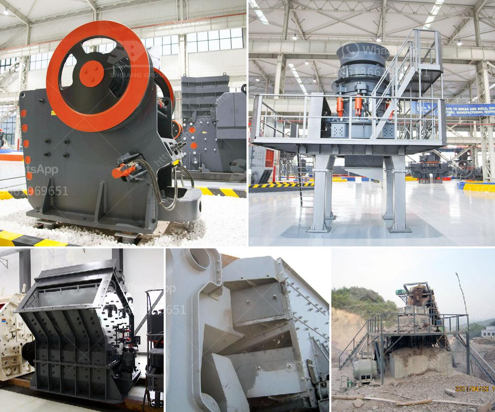

<h3>small ball mill suppliers in sri lanka</h3>
Small ball mill suppliers in Sri Lanka are not only renowned for the excellent quality of their machines but also their affordability. With the diversity of small ball mill models, their competitive prices and the fact that they can be used for a variety of materials, including ore and gravel, grinding operations, these machines have become quite popular in the Sri Lankan market.

One of the key advantages of small ball mill suppliers in Sri Lanka is the ease of operation and maintenance. These machines are designed to be user-friendly, making them suitable for both experienced technicians and beginners. The well-designed control panel, along with the clear instructions, ensures that users can easily learn how to operate and maintain them without any difficulties.

The efficiency of these small ball mills is another reason why they are highly sought after. These machines are known for their ability to grind materials into fine powders, making them suitable for various industries such as cement, construction, and chemical manufacturing. Whether you need to grind cement clinker or crush minerals, these small ball mills can effectively and efficiently meet your requirements.

Another advantage of choosing small ball mill suppliers in Sri Lanka is their high level of customer service and support. These suppliers ensure that each customer receives personalized attention and timely assistance throughout the purchasing process. Whether it's providing technical advice, assisting with installation, or addressing any concerns, the suppliers in Sri Lanka are committed to customer satisfaction.

In conclusion, small ball mill suppliers in Sri Lanka offer a wide range of benefits including affordability, ease of operation and maintenance, high efficiency, and excellent customer service. Whether you are a business owner looking to invest in a ball mill or a professional seeking to upgrade your current one, Sri Lankan suppliers are the ideal choice. With their reliable products and dedication to customer satisfaction, you can trust that your investment will be well worth it.
<h3>Contact us</h3><ul><li><strong>Whatsapp:&nbsp;<a href="https://wa.me/8613661969651">+8613661969651</a></strong></li><li><a href="https://swt.shibang-china.com/?git&amp;zhl&amp;small ball mill suppliers in sri lanka"><strong>Online Service(chat now)</strong></a></li></ul><h3>Related</h3><ul><li><a href='quarry machines from germany.md'>quarry machines from germany</a></li><li><a href='quarry crusher mine stone.md'>quarry crusher mine stone</a></li><li><a href='portable gold recovery mill for sale.md'>portable gold recovery mill for sale</a></li><li><a href='100 tph stone crusher price.md'>100 tph stone crusher price</a></li><li><a href='nigeria rock crusher for sale.md'>nigeria rock crusher for sale</a></li></ul>