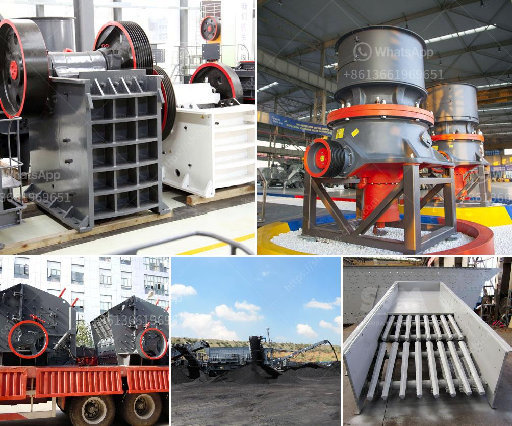

<h3>small concrete crusher used</h3>
Small concrete crushers are widely used in small-scale construction projects, such as bridges, roads, and residential buildings. The popularity of these machines has soared in recent years, mainly due to their ability to process various materials including concrete, asphalt, and bricks. This article will explore the benefits and applications of small concrete crushers.

One of the major advantages of using a small concrete crusher is its versatility. These machines are capable of crushing different types of materials, making them ideal for a range of construction projects. Whether it's removing concrete from a demolished structure or repurposing bricks for a new building, a small concrete crusher can handle it all.

Another significant benefit of using a small concrete crusher is its portability. These machines are compact and lightweight, making them easy to transport to different job sites. This portability allows contractors to bring the crusher directly to the location where the materials need to be processed. It eliminates the need for additional transportation, resulting in time and cost savings.

In addition to their versatility and portability, small concrete crushers are also known for their environmental benefits. By recycling concrete and other materials, these crushers help reduce the amount of waste that ends up in landfills. This sustainable approach reduces the environmental impact of construction projects and promotes the efficient use of resources.

Moreover, small concrete crushers are easy to operate, making them suitable for both experienced operators and newcomers in the construction industry. Most models come with user-friendly controls that allow precise adjustments and ensure safe operation. Furthermore, their small size enables operators to have better visibility and control over the crushing process.

The application of small concrete crushers is vast. They can be used to crush concrete waste generated during demolition projects, transforming it into reusable aggregates. These recycled materials can be used in new construction projects, reducing the need for virgin aggregates and thus preserving natural resources. Additionally, small concrete crushers are used to process asphalt and bricks, providing valuable materials that can be used in various applications.

In conclusion, small concrete crushers offer numerous benefits to contractors and construction companies. Their versatility, portability, environmental benefits, and ease of use make them an excellent choice for processing different materials on-site. By recycling concrete and other materials, these crushers contribute to sustainable construction practices and help reduce the environmental impact of construction projects. The wide range of applications for small concrete crushers also adds value to their use in various construction projects.
<h3>Contact us</h3><ul><li><strong>Whatsapp:&nbsp;<a href="https://wa.me/8613661969651">+8613661969651</a></strong></li><li><a href="https://swt.shibang-china.com/?git&amp;zhl&amp;small concrete crusher used"><strong>Online Service(chat now)</strong></a></li></ul><h3>Related</h3><ul><li><a href='gold mining machinery.md'>gold mining machinery</a></li><li><a href='complete crusher plant for sale.md'>complete crusher plant for sale</a></li><li><a href='gypsum production line for making.md'>gypsum production line for making</a></li><li><a href='silica sand washing plant in malaysia.md'>silica sand washing plant in malaysia</a></li><li><a href='type of crushers.md'>type of crushers</a></li></ul>