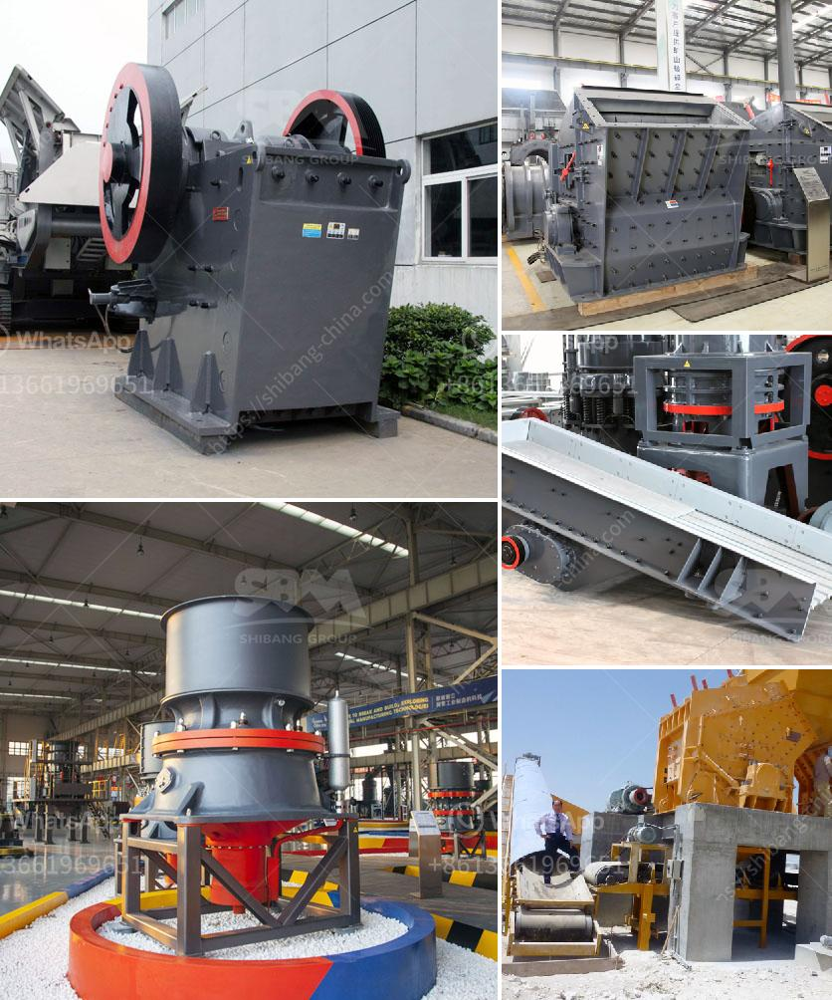

<h3>small impact crusher 100 mesh</h3>
In recent years, the demand for finely crushed materials for various industries has been rising. When it comes to crushing, no other machine can match the efficiency and versatility of a small impact crusher. This powerful machine is designed to break down a wide range of materials into smaller, more manageable sizes, making it a vital tool for many businesses.

One of the most impressive features of a small impact crusher is its ability to produce a high-quality end product, even when working with challenging materials. Whether it's limestone, granite, or concrete, this crusher can handle it all. Through its unique design and advanced technology, it can crush materials into particles as small as 100 mesh.

The 100 mesh output of the small impact crusher is ideal for creating high-quality aggregates for construction projects. These materials can be used to enhance the durability and strength of concrete, reduce asphalt costs, and even improve the overall appearance of the final product. With such versatility, it's no wonder that this machine is becoming a game-changer in the crushing industry.

Compared to larger impact crushers, the small impact crusher offers several advantages. Firstly, its compact size makes it easily transportable and allows it to be used in tighter spaces. This means it can be taken directly to the job site, reducing the need for additional transportation. Additionally, its smaller size also makes it more cost-effective, both in terms of purchasing and operating costs.

Despite its small size, a small impact crusher doesn't compromise on power and efficiency. It boasts a high-speed rotor that delivers maximum energy to the material being crushed, resulting in optimal performance. The adjustable outlet grate system allows for precise control of the final product size, making it suitable for various applications.

The small impact crusher is also incredibly user-friendly. Its intuitive control panel ensures easy operation, while its low maintenance requirements make it a hassle-free machine to own. With regular servicing, this crusher can provide years of reliable service, contributing to increased productivity and profitability.

For businesses looking to enhance their operations and stay ahead in a competitive market, investing in a small impact crusher proves to be a smart move. Not only does it offer a cost-effective solution for crushing materials, but it also opens up new opportunities for revenue generation. By producing high-quality aggregates, businesses can expand their customer base and attract more projects.

In conclusion, the small impact crusher is a versatile and efficient machine that is revolutionizing the crushing industry. With its ability to produce finely crushed materials, it enables businesses to enhance their productivity and profitability. Whether for construction, mining, or recycling, this crusher delivers exceptional performance and offers a cost-effective solution. Investing in a small impact crusher guarantees a game-changing impact on your business.
<h3>Contact us</h3><ul><li><strong>Whatsapp:&nbsp;<a href="https://wa.me/8613661969651">+8613661969651</a></strong></li><li><a href="https://swt.shibang-china.com/?git&amp;zhl&amp;small impact crusher 100 mesh"><strong>Online Service(chat now)</strong></a></li></ul><h3>Related</h3><ul><li><a href='stone crushing machines for sale.md'>stone crushing machines for sale</a></li><li><a href='stone crusher plant minimum capacity price in india.md'>stone crusher plant minimum capacity price in india</a></li><li><a href='manufacturer of coal processing equipment.md'>manufacturer of coal processing equipment</a></li><li><a href='used ball mill south africa.md'>used ball mill south africa</a></li><li><a href='nickel slag grinding project in turkey.md'>nickel slag grinding project in turkey</a></li></ul>