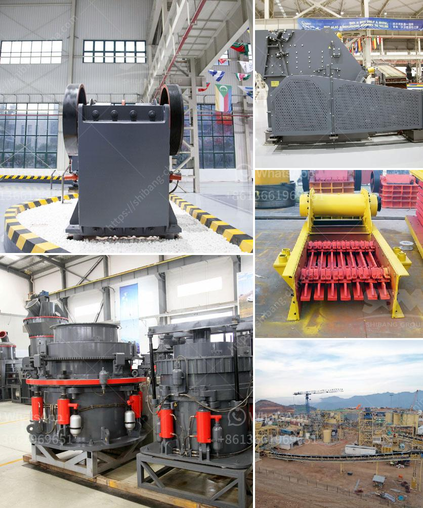

<h3>small jaw crusher uk</h3>
In the construction industry, there are often situations where raw materials need to be processed into smaller sizes for various purposes. This is where a small jaw crusher comes into play. A small jaw crusher is a machine designed to reduce the size of stones and rocks, shaping them into smaller sizes for use in construction projects or other applications. With its compact and efficient design, a small jaw crusher is ideal for small-scale construction or demolition projects, as well as for use in landscaping, housing developments, and other similar applications.

One of the key advantages of a small jaw crusher is its versatility. Despite its small size, it is capable of handling a wide range of materials, including concrete, bricks, asphalt, rock, and more. This makes it a valuable tool for construction companies and contractors who often need to process different types of materials on-site. By using a small jaw crusher, they can easily crush and process materials, eliminating the need for additional machinery or transportation costs.

A small jaw crusher is easy to operate, requiring minimal training and maintenance. Most models come with user-friendly controls, allowing operators to adjust the settings and produce the desired size of crushed material. Additionally, modern small jaw crushers are designed with safety features in place, ensuring the operator's well-being throughout the operation.

Another advantage of a small jaw crusher is its mobility. Many models are designed to be towed by a truck, making it easy to transport the crusher to different job sites. This eliminates the need for a stationary crusher and reduces overall project costs. Moreover, the compact size of a small jaw crusher allows it to navigate through narrow spaces, making it suitable for use in urban areas or confined construction sites.

In the United Kingdom, small jaw crushers are widely used in the construction industry. Due to their compact size and efficient performance, they have become indispensable tools for construction companies, landscaping businesses, and even individual homeowners. Whether it's crushing concrete for recycling purposes, processing rock for landscaping projects, or reducing bricks and tiles for reuse, a small jaw crusher can handle it all.

Furthermore, with the growing emphasis on sustainable construction practices, the use of small jaw crushers in the UK has gained even more popularity. By crushing materials on-site, companies can reduce the environmental impact associated with transporting materials to and from a stationary crusher. This not only saves fuel and reduces greenhouse gas emissions but also minimizes the need for landfill space, contributing to a cleaner and more sustainable environment.

In conclusion, a small jaw crusher is an efficient and versatile crushing solution for construction sites in the UK. Its compact size, ease of operation, and mobility make it an ideal choice for small-scale construction projects. With its ability to process different types of materials, it is a valuable tool for contractors and construction companies. Additionally, the use of small jaw crushers promotes sustainable construction practices by reducing transportation needs and minimizing waste. As the demand for on-site material processing continues to grow, the small jaw crusher remains an essential piece of equipment in the construction industry.
<h3>Contact us</h3><ul><li><strong>Whatsapp:&nbsp;<a href="https://wa.me/8613661969651">+8613661969651</a></strong></li><li><a href="https://swt.shibang-china.com/?git&amp;zhl&amp;small jaw crusher uk"><strong>Online Service(chat now)</strong></a></li></ul><h3>Related</h3><ul><li><a href='stone quarry companies in ghana.md'>stone quarry companies in ghana</a></li><li><a href='coal processing plants.md'>coal processing plants</a></li><li><a href='laboratory grinding mills jaw crushers.md'>laboratory grinding mills jaw crushers</a></li><li><a href='quarry crusher manufacturer.md'>quarry crusher manufacturer</a></li><li><a href='roller mill compontes.md'>roller mill compontes</a></li></ul>