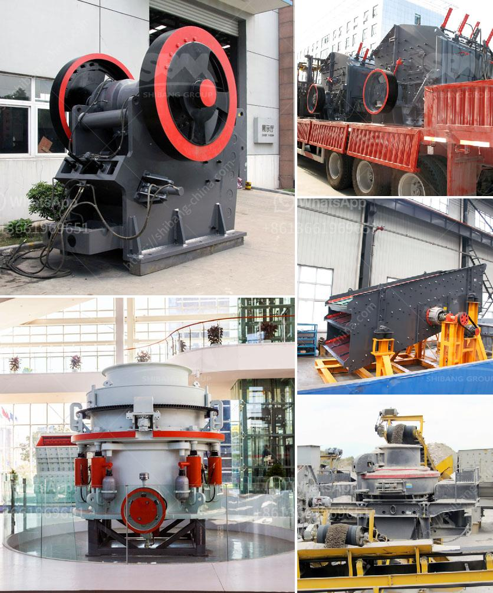

<h3>small mobile stone crushers</h3>
Small mobile stone crushers are designed for small scale quarrying and mining operations that require efficient and high-quality crushing equipment. These crushers are typically portable and easily transportable, offering convenience and flexibility in use.

Mobile stone crushers are capable of crushing basalt rock, granite, limestone, and other stones into various sizes for different applications. They are equipped with major components that enable high productivity and quick turnaround times. The crushers come with a powerful engine and a hydraulic system that efficiently crushes and separates the stones. This ensures an optimal crushing process and reduces the need for manual labor.

One of the advantages of a small mobile stone crusher is its versatility. It can be used in different types of applications, including construction sites, road projects, and demolition jobs. The compact size and portable design make it easy to move the crusher from one site to another, reducing transportation costs and saving time.

In addition to their mobility and versatility, small mobile stone crushers also offer significant cost savings. They are often rented or leased by contractors and project managers, eliminating the need to purchase expensive equipment. Furthermore, these crushers consume less fuel, reducing operating costs and environmental impact.

Safety is another crucial aspect of small mobile stone crushers. They are equipped with safety features such as emergency stop buttons, protective covers, and warning lights. These ensure the safety of operators and reduce the risk of accidents and injuries.

Overall, small mobile stone crushers are an essential tool for contractors and project managers in the construction and mining industry. They offer numerous benefits, including high productivity, versatility, cost-effectiveness, and improved safety. Whether it's crushing stones for road construction or demolishing old buildings, these crushers are an efficient and reliable solution.
<h3>Contact us</h3><ul><li><strong>Whatsapp:&nbsp;<a href="https://wa.me/8613661969651">+8613661969651</a></strong></li><li><a href="https://swt.shibang-china.com/?git&amp;zhl&amp;small mobile stone crushers"><strong>Online Service(chat now)</strong></a></li></ul><h3>Related</h3><ul><li><a href='vrm vertical roller mill.md'>vrm vertical roller mill</a></li><li><a href='250 tph mobile stone crusher price in india.md'>250 tph mobile stone crusher price in india</a></li><li><a href='mobile coal jaw crusher provider in south africa.md'>mobile coal jaw crusher provider in south africa</a></li><li><a href='4 roller mill for stone.md'>4 roller mill for stone</a></li><li><a href='hammer crusher price one ton per hour.md'>hammer crusher price one ton per hour</a></li></ul>