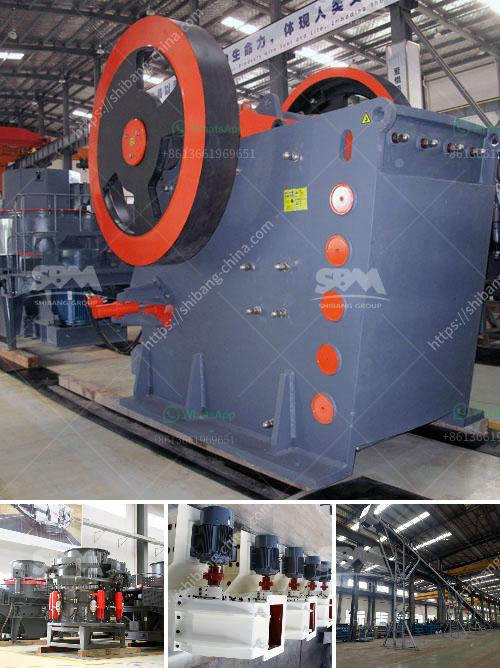

<h3>small rock crusher machine for sale</h3>
Crushing is the process of transferring a force amplified by mechanical advantage through a material made of molecules that bond together more strongly, and resist deformation more, than those in the material being crushed do. Crushing devices hold material between two parallel or tangent solid surfaces, and apply sufficient force to bring the surfaces together to generate enough energy within the material being crushed so that its molecules separate from (fracturing), or change alignment in relation to (deformation), each other.

Rock crushers are extensively used in the mining industry where rocks containing the ore are crushed before the mineral is extracted. In most cases, mining operations may have more than one crusher depending on the desired outcome of the crushing process. The primary crusher handles course rocks while the secondary, tertiary, and sometimes the quaternary works on finer gradations that can allow for effective extraction of minerals. Use of Rock Crushers in Gold Mining unlike the manual labor force that has been used in crushing rocks for centuries, a machine has been invented to simplify this process. This machine is highly efficient and it simplifies the crushing process. It has a high processing capacity and it can be used in the mining and construction industries to crush large rocks. A machine such as this is essentially a high-speed rotor, which contains a series of hammers perched on its main shaft. The hammers strike the rocks that are placed in a hopper that extends the full width of the crusher. Crushed rocks are discharged out of the bottom opening. Though the machines are small in size, they are capable of producing considerable amounts of crushed rocks.

Small rock crushers are ideal for small construction sites and small-scale mining projects. They are characterized by simplicity, ease of use, and maintenance, as well as the ability to crush a wide range of materials. The small rock crusher machine has the benefits of high efficiency, low energy consumption, reliable operation, and easy maintenance. The machine can be operated remotely, making it highly flexible.

Small rock crushers are suitable for crushing all kinds of hard and soft rocks with compressive strength not higher than 320MPa. The crushed materials are widely used in mining, quarrying, metallurgy, building materials, roads, railways, water conservancy, chemical industry, and other industries.

When selecting a small rock crusher, it is essential for the user to navigate the options and choose the most suitable one based on the specific requirements. Key factors to consider include the type of rock to be crushed, the overall size of the rocks in the intended application, the desired output size and capacity, as well as the budget.

In conclusion, small rock crusher machines provide a cost-effective solution for customers to produce highly quality materials. Whether in construction or mining, a rock crusher machine is a vital component for projects to ensure product quality, efficiency, and safety. With continuous advancements in technology and machinery design, rock crushers are becoming more user-friendly and can be operated remotely, providing convenience and improving productivity.
<h3>Contact us</h3><ul><li><strong>Whatsapp:&nbsp;<a href="https://wa.me/8613661969651">+8613661969651</a></strong></li><li><a href="https://swt.shibang-china.com/?git&amp;zhl&amp;small rock crusher machine for sale"><strong>Online Service(chat now)</strong></a></li></ul><h3>Related</h3><ul><li><a href='big stone quarry business plan pdf.md'>big stone quarry business plan pdf</a></li><li><a href='20mm feeding hydraulic cone crusher price.md'>20mm feeding hydraulic cone crusher price</a></li><li><a href='crushing machine manufacturers china.md'>crushing machine manufacturers china</a></li><li><a href='10 tph cone crusher price.md'>10 tph cone crusher price</a></li><li><a href='chrome washing plant for sale.md'>chrome washing plant for sale</a></li></ul>