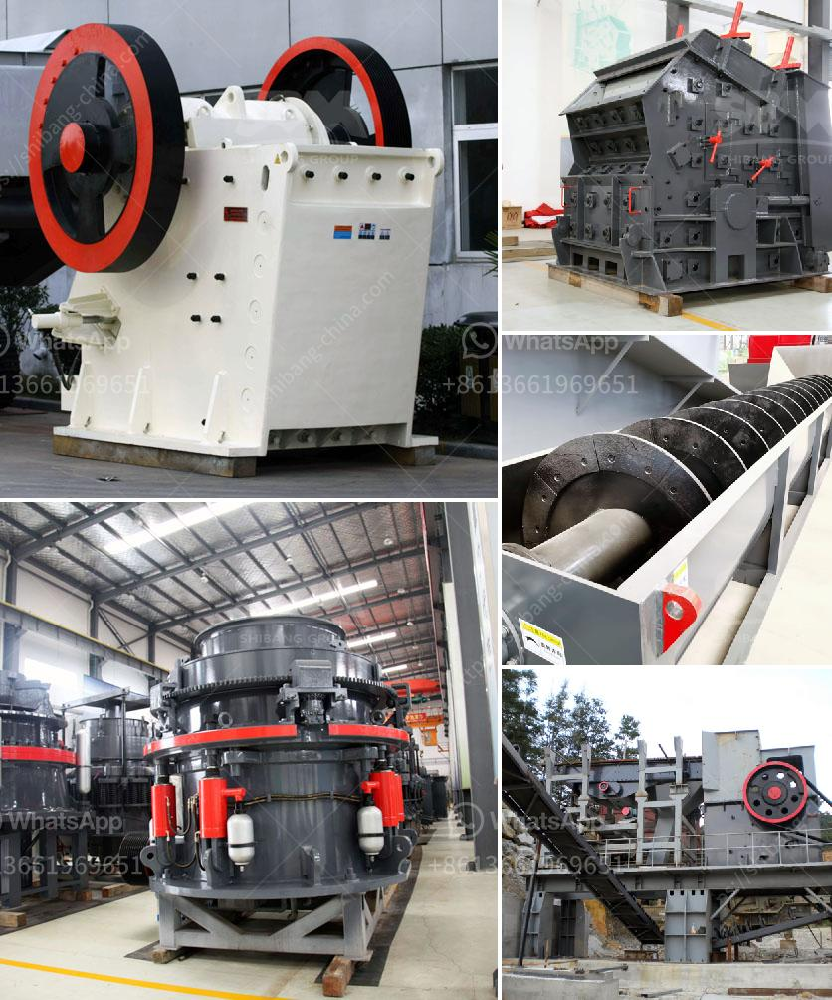

<h3>small sand making machine pictures and price</h3>
In the construction industry, the demand for sand is constantly increasing. Sand is a crucial component used in the production of concrete, asphalt, and mortar. However, extracting sand from natural sources such as rivers and beaches is not only harmful to the environment but also not sustainable in the long run. This is where small sand making machines come into play, revolutionizing the way sand is produced.

Small sand making machines, also known as mini sand making machines, are compact and efficient machines designed to produce high-quality sand. These machines have been gaining popularity in the construction industry due to their ability to reduce costs and environmental impact.

One of the advantages of small sand making machines is their portability. These machines occupy minimal space and can be easily transported from one construction site to another. This feature makes them particularly suitable for small-scale construction projects or remote locations where there is limited access to sand.

Another significant advantage of small sand making machines is their cost-effectiveness. Unlike large-scale sand production plants, which require a substantial investment, small sand making machines are affordable and accessible to a wider range of contractors. Moreover, their operational costs, including energy consumption and maintenance, are lower compared to traditional sand extraction and processing methods.

But what about the quality of sand produced by these small machines? Well, the good news is that small sand making machines are designed to deliver high-quality sand that meets industry standards. They employ advanced technology to crush and shape the raw materials, ensuring the final product is consistent and suitable for various construction purposes. Additionally, these machines have adjustable parameters, allowing users to tailor the sand's particle size and shape according to their specific requirements.

Now let's talk about their price range and provide some pictures for reference. The price of small sand making machines can vary depending on the manufacturer, model, and features. On average, a basic model of a small sand making machine can cost anywhere between $5,000 and $10,000. However, it is essential to consider factors such as warranty, after-sales service, and availability of spare parts when comparing prices.

To give you a visual representation, check out the attached pictures showcasing different models of small sand making machines. These pictures can help you understand the size, shape, and overall appearance of these remarkable machines.

In conclusion, small sand making machines have emerged as a game-changer in the construction industry. They offer numerous advantages such as portability, cost-effectiveness, and high-quality sand production. With their ability to reduce environmental damage caused by sand extraction from natural sources, these machines have become the go-to solution for contractors, especially those involved in small-scale projects. Considering their affordable price range and incredible performance, it's safe to say that small sand making machines are here to stay.
<h3>Contact us</h3><ul><li><strong>Whatsapp:&nbsp;<a href="https://wa.me/8613661969651">+8613661969651</a></strong></li><li><a href="https://swt.shibang-china.com/?git&amp;zhl&amp;small sand making machine pictures and price"><strong>Online Service(chat now)</strong></a></li></ul><h3>Related</h3><ul><li><a href='machinery to crush quartz.md'>machinery to crush quartz</a></li><li><a href='quartz crusher prices.md'>quartz crusher prices</a></li><li><a href='models and prices of vibrating screens.md'>models and prices of vibrating screens</a></li><li><a href='industrial glass crusher worldcrushers.md'>industrial glass crusher worldcrushers</a></li><li><a href='kaolin processing machinery.md'>kaolin processing machinery</a></li></ul>