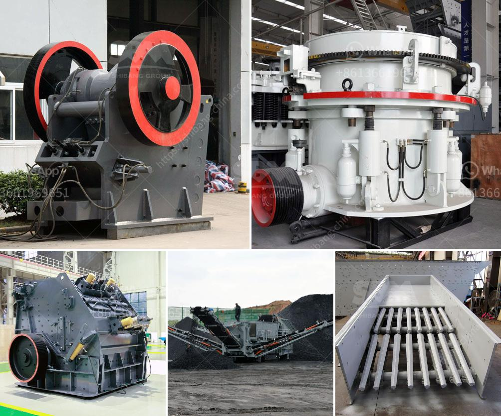

<h3>small scale gold mining in zimbabwe</h3>
Small-scale gold mining in Zimbabwe is a crucial livelihood for many people, particularly in rural areas. According to the country's Ministry of Mines and Mining Development, gold production contributes about 60% of the total mineral exports. Zimbabwe's rich gold reserves have attracted both local and foreign investment, leading to the involvement of small-scale miners in the sector.

This type of mining involves the use of rudimentary methods and equipment, making it accessible to individuals or groups with limited financial resources. Small-scale miners typically work in the field individually, or in small teams, often comprising family members or friends. Throughout the process, from extraction to processing, their main tools are picks, shovels, and simple sluice boxes.

However, while small-scale gold mining provides employment and income to many people, it also poses significant environmental and health risks. The use of mercury in the gold extraction process is prevalent among these miners, as it helps separate gold particles from the ore. Unfortunately, the improper handling and disposal of mercury can lead to severe health problems for miners and the surrounding communities.

To address these challenges, the Zimbabwean government, in collaboration with various international organizations, has embarked on initiatives to promote responsible and sustainable small-scale gold mining practices. These initiatives focus on providing education and training on safer mining methods and alternative technologies to minimize the use of mercury.

Additionally, efforts are being made to formalize the small-scale gold mining sector, allowing miners to access the necessary permits and licenses. This formalization process helps legitimize the sector and enables miners to access markets, credit facilities, and government support.

Overall, small-scale gold mining in Zimbabwe plays a critical role in providing employment and livelihood opportunities for many people. However, it is essential to ensure that miners adopt responsible and sustainable practices that prioritize the well-being of both the environment and the miners themselves. Through education, training, and formalization, the sector can contribute to the country's economic growth while minimizing its negative impact.
<h3>Contact us</h3><ul><li><strong>Whatsapp:&nbsp;<a href="https://wa.me/8613661969651">+8613661969651</a></strong></li><li><a href="https://swt.shibang-china.com/?git&amp;zhl&amp;small scale gold mining in zimbabwe"><strong>Online Service(chat now)</strong></a></li></ul><h3>Related</h3><ul><li><a href='stone cutting machine in india.md'>stone cutting machine in india</a></li><li><a href='jaw crusher 24x12 price.md'>jaw crusher 24x12 price</a></li><li><a href='stone crusher price list 300 tonnes capacity per hour.md'>stone crusher price list 300 tonnes capacity per hour</a></li><li><a href='coal screening plant.md'>coal screening plant</a></li><li><a href='roller crusher for sale gumtree.md'>roller crusher for sale gumtree</a></li></ul>