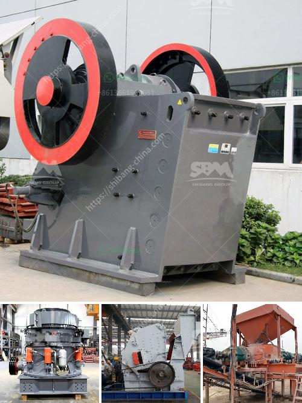

<h3>small scale gold process pictures</h3>
Gold has been sought after and treasured for centuries, captivating the hearts of men and women alike with its radiant shine. Today, gold continues to be a symbol of wealth, luxury, and enduring value. While large-scale mining operations dominate the gold industry, there is also a place for small-scale gold processing, a fascinating and essential part of the gold supply chain.

Small-scale gold processing refers to the process of extracting gold on a smaller scale, typically through manual labor or using simple tools and equipment. This practice is often seen in developing countries where individuals or small groups of miners, known as artisanal miners, work independently or in small collectives.

The process of small-scale gold processing begins with the search for gold-rich ores or deposits, which are typically found in rivers, streams, or underground. In many cases, artisanal miners rely on traditional methods such as panning, sluicing, or using simple tools like picks and shovels to extract the gold-bearing material.

Once the ore is collected, it is often crushed into smaller particles to release the gold. This can be done manually using mortar and pestle or mechanical crushers. The crushed ore is then placed in pans or sluices. In the case of panning, swirling the mixture allows the heavier gold particles to settle at the bottom due to their high density, while the lighter materials are washed away.

Sluicing is another common method used in small-scale gold processing. It involves the use of a long channel or trough with riffles to trap the gold particles. As water flows through the sluice, the heavier gold particles are caught by the riffles, while the lighter materials are washed away.

Once the gold particles are separated from the ore, they are usually further concentrated using various methods. One such method is amalgamation, where mercury is added to the gold-bearing material to form an amalgam. This amalgam is then heated, allowing the mercury to evaporate and leaving behind pure gold.

It is important to note that small-scale gold processing, while essential for many communities, can also have detrimental environmental and health impacts. The use of mercury, for instance, can lead to mercury poisoning, contaminating water sources and endangering both the miners and surrounding ecosystems.

Efforts are being made to address these concerns and promote safer and more sustainable practices within the small-scale gold processing industry. For instance, organizations like the International Labour Organization (ILO) and the United Nations Development Programme (UNDP) work to educate and provide assistance to artisanal miners, encouraging the use of responsible mining techniques and reducing mercury use.

In conclusion, small-scale gold processing plays a crucial role in the gold supply chain, providing livelihoods for many individuals and communities worldwide. The labor-intensive nature of this process, coupled with its challenges and risks, render it an admirable endeavor. However, it is essential to promote responsible mining practices to safeguard both the environment and the health of those involved in this glittering pursuit.
<h3>Contact us</h3><ul><li><strong>Whatsapp:&nbsp;<a href="https://wa.me/8613661969651">+8613661969651</a></strong></li><li><a href="https://swt.shibang-china.com/?git&amp;zhl&amp;small scale gold process pictures"><strong>Online Service(chat now)</strong></a></li></ul><h3>Related</h3><ul><li><a href='safety videos of belt conveyors in hindi.md'>safety videos of belt conveyors in hindi</a></li><li><a href='jaw crusher machine in saudi.md'>jaw crusher machine in saudi</a></li><li><a href='canyon hammer mills.md'>canyon hammer mills</a></li><li><a href='cost of silica sand mine equipment.md'>cost of silica sand mine equipment</a></li><li><a href='stone manufacturing process.md'>stone manufacturing process</a></li></ul>