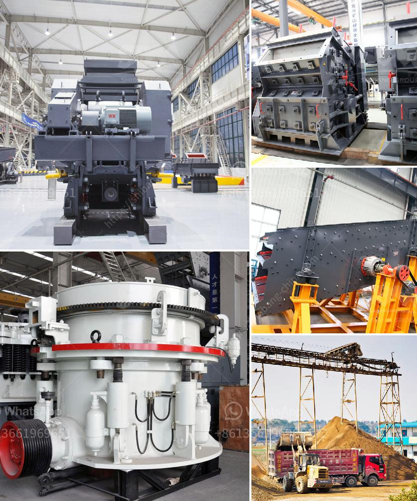

<h3>small stone crusher machine in italy</h3>
Small stone crusher machine in Italy, is the latest generation of the crusher, which integrates the most advanced international crushing technology and manufacturing level. Small stone crusher machine in Italy is widely used for medium crushing various ores and bulk materials in mining, smelting, building materials, highway, railway, water, chemical industry and other industries. The crushed materials are of a compressive strength less than 320MPa.

The small stone crusher machine in Italy is made of high-quality wear-resistant materials, and the crushing chamber uses the "V" structure, and is connected in a compact and strong rigidity type. It has a deep crushing cavity to reduce the materials' falling into the crushing chamber, thus avoiding damage to the equipment. The small stone crusher machine in Italy has a simple structure and light weight, which makes it easy to operate and maintain.

The productivity of the small stone crusher machine in Italy is high, and the crushing ratio is large. In addition, the small stone crusher machine in Italy has low energy consumption, good particle shape and reasonable grading, and is suitable for any sand and gravel production line.

Compared with other small crushers, the small stone crusher machine in Italy has higher quality and lower price. Under this premise, the overall investment in the whole process is far lower than the other crushing equipment. However, the quality of the equipment produced by different manufacturers is different, and the price is different, which requires users to choose the right small stone crusher machine in Italy according to their actual needs.

In conclusion, the small stone crusher machine in Italy from has been the practical and reliable stone crushing machine on the market. It has been based on the technology and benefits of the larger gyratory crushers from the past few years and now the small stone crusher machine in Italy is one of the series of cone crushers. It also has improved productivity and operational costs compared to other small stone crushers.
<h3>Contact us</h3><ul><li><strong>Whatsapp:&nbsp;<a href="https://wa.me/8613661969651">+8613661969651</a></strong></li><li><a href="https://swt.shibang-china.com/?git&amp;zhl&amp;small stone crusher machine in italy"><strong>Online Service(chat now)</strong></a></li></ul><h3>Related</h3><ul><li><a href='china grove roller mill.md'>china grove roller mill</a></li><li><a href='vrm vertical roller mill.md'>vrm vertical roller mill</a></li><li><a href='stone quarry crusher in kasoa.md'>stone quarry crusher in kasoa</a></li><li><a href='machinery for magnesium extracted from dolomite.md'>machinery for magnesium extracted from dolomite</a></li><li><a href='application procedure for ball mill.md'>application procedure for ball mill</a></li></ul>