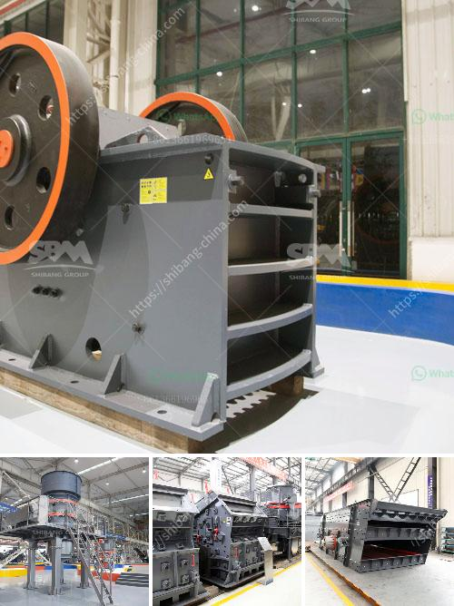

<h3>small stone crusher plant in india</h3>
India has a rich history of environmental preservation, and the recent emphasis on renewable energy and sustainable development has led to the growth of the small-scale stone crusher industry. Stone crushers are a vital part of the construction industry as they provide valuable aggregates necessary for concrete production, road construction, and other infrastructure projects.

Small stone crusher plants are often used to process hard and abrasive materials such as granite, limestone, and iron ore. These materials are crushed into small particles to make them usable in construction and other industries. Since stone crushing is a labor-intensive process, small-scale stone crusher plants are also known as mini or small stone crushing units.

These small-scale stone crusher plants are suitable for medium hardness rocks and stones, ranging from blue metal to limestone. They can be easily moved and designed to provide reliable crushing operation. Their compact size and easy maintenance make them preferable for smaller construction sites and industries.

One of the key advantages of small stone crusher plants in India is their flexibility in terms of material selection and operation. Stone crushers can be easily adapted to different crushing requirements, opening up a new range of business opportunities for contractors, quarry operators, recycling, and mining applications.

In addition to stone crushers, India also has a growing demand for sand and gravel production. With the rapid development of infrastructure projects, the demand for sand and gravel continues to rise. Small stone crusher plants can meet various demands for both coarse and fine aggregates, ensuring steady and reliable supply of high-quality materials.

Small stone crusher plants in India are closing the gap between stationary and mobile crushing plants, offering contractors a range of options for stone crushing and recycling. With advanced technologies and comprehensive service support, India's small-scale stone crusher industry is booming and has a bright future ahead.
<h3>Contact us</h3><ul><li><strong>Whatsapp:&nbsp;<a href="https://wa.me/8613661969651">+8613661969651</a></strong></li><li><a href="https://swt.shibang-china.com/?git&amp;zhl&amp;small stone crusher plant in india"><strong>Online Service(chat now)</strong></a></li></ul><h3>Related</h3><ul><li><a href='buy quarry crusher machine from turkey.md'>buy quarry crusher machine from turkey</a></li><li><a href='pulverizer for carbon black.md'>pulverizer for carbon black</a></li><li><a href='vertical ball mills.md'>vertical ball mills</a></li><li><a href='talcum powder bp usp manufacturers in india.md'>talcum powder bp usp manufacturers in india</a></li><li><a href='used jaw crushers from oman.md'>used jaw crushers from oman</a></li></ul>