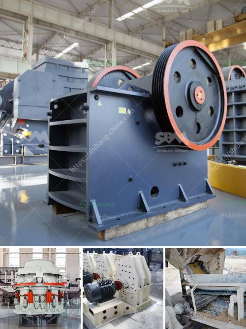

<h3>small stone crusher supplier in the philippines</h3>
With the rapid development of the construction and mining industry, the demand for stone crushers is increasing significantly. In order to meet the needs of customers, many suppliers and manufacturers of stone crusher machines are springing up in the Philippines. As a reliable supplier, the price of the stone crusher machines we provide are reasonable and competitive.

Typically, the stone crusher machines in the Philippines are utilized for crushing various minerals, such as granite, limestone, iron ore, and other types of stones. For example, the Philippines has a rich mineral resource, and copper ore is one of them. With the development of technology, the jaw crusher and cone crusher are widely used in the mineral processing plant.

The traditional jaw crusher is often used as primary crusher and the cone crusher is used as secondary crusher. The stone crusher machines have many different types according to the different physical and chemical characteristics of various stones, such as jaw crusher machines, impact crusher machines, cone crusher machines, roller crushing machines, and so on. All these different crusher machines have their own characteristics and application fields.

In terms of the application field of the small stone crusher screen supplier in the Philippines, it is widely used in the production lines of various materials, such as concrete, granite, basalt, limestone, etc., including the crushing and screening of stones in the quarry. It can also be used as construction waste disposal equipment to crush materials such as pebbles, rock fragments, and tailings. The small stone crusher suppliers in the Philippines also provide users with efficient and low-cost sand making equipment, which can greatly improve the production efficiency of users and reduce the cost of production. In addition, the stone crusher machines have a stable operation performance, high output, excellent grain shape, and good grain size, which meets the requirements of various aggregate conditions.

As a professional stone crusher machine supplier in the Philippines, our aimix group provides turnkey services for both mine stone crushing and industrial grinding. We provide all kinds of stone crusher machines, like jaw crusher, cone crusher, impact crusher, and so on, for the customers to choose. We also provide technical support and complete stone crusher plant and equipment installation and commissioning services. Our stone crusher machines have been exported to over 90 countries, such as India, Indonesia, Malaysia, Kenya, Tanzania, Ethiopia, Nigeria, South Africa, Egypt, etc. If you are interested, please feel free to contact us, and we will provide you with the highest quality equipment and the most affordable price.

In conclusion, the small stone crusher supplier in the Philippines is suitable for customers with small production capacity. For those who are less familiar with stone crusher machines, it is recommended to choose reputable and reliable manufacturers when purchasing equipment, and choose equipment that meets their own production scale and production needs. The small stone crusher machines provided by the Philippines supplier are also suitable for users who are just entering the mining industry or have limited funds. The price of stone crushers is relatively low compared with other manufacturers. For more details, please contact us or visit our website: www.aimixcrusherplants.com.
<h3>Contact us</h3><ul><li><strong>Whatsapp:&nbsp;<a href="https://wa.me/8613661969651">+8613661969651</a></strong></li><li><a href="https://swt.shibang-china.com/?git&amp;zhl&amp;small stone crusher supplier in the philippines"><strong>Online Service(chat now)</strong></a></li></ul><h3>Related</h3><ul><li><a href='enquiry jaw crusher.md'>enquiry jaw crusher</a></li><li><a href='grinding machine capacity 1tph stone crusher machine.md'>grinding machine capacity 1tph stone crusher machine</a></li><li><a href='mobile crushers for sale.md'>mobile crushers for sale</a></li><li><a href='concrete crushing machine price in china.md'>concrete crushing machine price in china</a></li><li><a href='fly ash grinding.md'>fly ash grinding</a></li></ul>