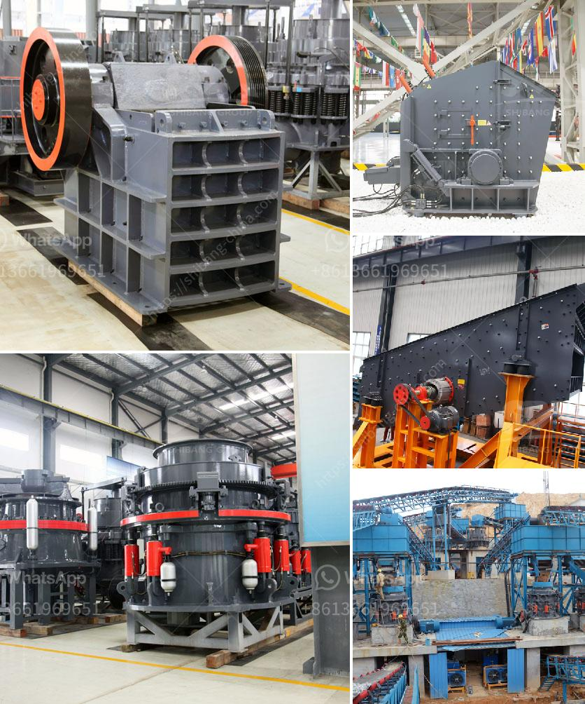

<h3>smallest cement plant</h3>
Innovation has long driven progress across industries, and the cement manufacturing sector is no exception. Despite being a fundamental material in the construction industry, the traditional size of cement plants is often quite substantial. However, recent technological advancements have enabled the development of ultra-compact cement plants, revolutionizing the way this crucial material is produced. In this article, we will delve into the world's smallest cement plant, discussing its features, advantages, and the groundbreaking potential it holds for the construction industry.

The smallest cement plant, as a product of cutting-edge engineering and compact design, is a miniature cement production facility that can fit in a limited space while maximizing output. With a production capacity typically ranging from 25 to 50 metric tons per day, this plant is revolutionizing small-scale cement manufacturing. Unlike its larger counterparts, this compact plant requires minimal capital investment and has reduced operational costs. Additionally, its modular construction allows for quick assembly and commissioning, ensuring efficient project execution.

Despite its modest scale, the smallest cement plant brings forth a myriad of advantages. Primarily, it empowers local entrepreneurs or small and medium scale enterprises (SMEs) to establish their own cement manufacturing units, creating self-sufficiency and boosting economic growth. Its modest size also ensures a quicker return on investment, encouraging more individuals to enter this sector. Furthermore, the eco-friendly features of the smallest cement plant, including lower energy consumption and reduced CO2 emissions, contribute to sustainable development by minimizing environmental impact and cultivating greener construction practices.

The compact nature of the smallest cement plant opens doors to various applications. It is particularly advantageous for regions with limited access to cement market due to logistical difficulties or high transportation costs. These mini-plants can be established near the source of raw materials, reducing transportation expenses and fostering localized production. Moreover, they serve as essential tools for infrastructure development in areas lacking large-scale industries. By enabling job creation and localized production, the smallest cement plants can accelerate growth in rural or underdeveloped regions.

The emergence of the smallest cement plant signifies a promising future for the construction industry. As developing countries continue to invest in infrastructure, these compact plants provide a viable and cost-effective solution to meet the growing demand for cement. The utilization of smaller cement plants also aligns with sustainable development goals, focusing on localized production, reduced energy consumption, and curbing carbon emissions. With ongoing advancements and increased awareness, the smallest cement plant is poised to play a significant role in transforming the global cement manufacturing landscape.

The smallest cement plant demonstrates the remarkable potential of achieving high efficiency while being compact and environmentally friendly. Its ability to address the needs of local entrepreneurs and serve the underserved areas is a significant step towards inclusive economic growth and sustainable development. As we witness the ongoing evolution of cement manufacturing, embracing and leveraging the innovation offered by the smallest cement plant will undoubtedly amplify the positive impact of this essential construction material.
<h3>Contact us</h3><ul><li><strong>Whatsapp:&nbsp;<a href="https://wa.me/8613661969651">+8613661969651</a></strong></li><li><a href="https://swt.shibang-china.com/?git&amp;zhl&amp;smallest cement plant"><strong>Online Service(chat now)</strong></a></li></ul><h3>Related</h3><ul><li><a href='pulverized ball mills.md'>pulverized ball mills</a></li><li><a href='stone crusher machine philippines.md'>stone crusher machine philippines</a></li><li><a href='granite crusher technology.md'>granite crusher technology</a></li><li><a href='used portable roller crushers and screens.md'>used portable roller crushers and screens</a></li><li><a href='small concrete crusher used.md'>small concrete crusher used</a></li></ul>