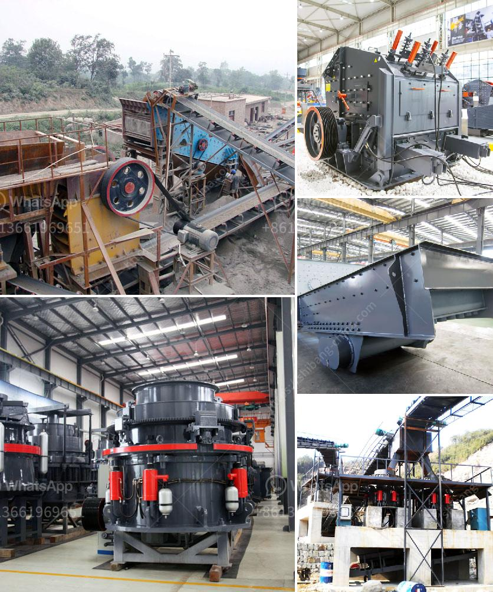

<h3>south africa mining law on crusher</h3>
Mining plays a crucial role in South Africa's economy, contributing significantly to its GDP and employing a large portion of the population. The mining industry in South Africa is known for its rich mineral resources, including gold, diamonds, platinum, coal, and copper. However, the extraction of these minerals also comes with various environmental, social, and health impacts.

To regulate the mining sector and mitigate these challenges, South Africa has implemented robust mining laws and regulations. These laws aim to ensure sustainable development, protect the environment, secure the rights of affected communities, and create a fair and transparent industry.

One key aspect of South Africa's mining laws is the regulation of crushers, which are essential equipment used in the processing of minerals. Crushers are used to break down large rocks into smaller, more manageable sizes, facilitating the extraction and transport of ore. However, crusher operations can generate significant dust, noise, and vibrations, causing adverse impacts on the environment and nearby communities.

The Mineral and Petroleum Resources Development Act (MPRDA) of 2002 is the primary legislation governing mining activities in South Africa. The MPRDA empowers the Minister of Mineral Resources and Energy to regulate the environmental and social impacts of mining operations, including crushers. Under this Act, the Minister may impose certain conditions on mining rights holders to mitigate negative impacts.

Additionally, the National Environmental Management Act (NEMA) provides a legal framework for environmental management in South Africa. The Department of Mineral Resources and Energy (DMRE) works in conjunction with the Department of Environment, Forestry, and Fisheries (DEFF) to enforce environmental protection measures in the mining sector.

To ensure compliance with environmental standards, mining companies are required to conduct Environmental Impact Assessments (EIAs) before commencing operations. An EIA assesses the potential environmental and social risks of a project and proposes mitigation measures. The EIA process involves public participation, allowing affected communities to voice their concerns and participate in decision-making.

Regarding crushers specifically, South Africa has developed guidelines for the control of dust and emissions. These guidelines set permissible limits for dust and other pollutants emitted by crushers and require mining companies to implement adequate dust suppression systems. Additionally, noise and vibration monitoring requirements are set to protect nearby communities from excessive noise pollution.

Furthermore, South Africa's mining laws recognize the importance of meaningful engagement with affected communities. Mining companies are required to consult and engage with stakeholders, including local communities, to address their concerns and ensure the fair sharing of benefits. This helps foster social cohesion and ensures that mining operations properly integrate with the surrounding communities.

Despite these regulations, challenges remain in the enforcement of mining laws and ensuring compliance. Weak enforcement capacities, corruption, and inadequate monitoring systems hinder effective implementation. Additionally, there is a need for continuous improvement and adaptation of regulations to address emerging environmental and social risks associated with crushers and other mining activities.

In conclusion, South Africa's mining laws and regulations pertaining to crushers reflect the country's commitment to sustainable development, environmental protection, and community participation. These laws aim to strike a balance between economic growth and the need to minimize the negative impacts of mining on the environment and communities. By enforcing these laws effectively and continuously refining them, South Africa can ensure that its mining industry operates responsibly, contributing to the country's development while safeguarding its natural and social capital.
<h3>Contact us</h3><ul><li><strong>Whatsapp:&nbsp;<a href="https://wa.me/8613661969651">+8613661969651</a></strong></li><li><a href="https://swt.shibang-china.com/?git&amp;zhl&amp;south africa mining law on crusher"><strong>Online Service(chat now)</strong></a></li></ul><h3>Related</h3><ul><li><a href='stone crusher seller.md'>stone crusher seller</a></li><li><a href='vibrating screen size decision.md'>vibrating screen size decision</a></li><li><a href='products pe jaw crusher.md'>products pe jaw crusher</a></li><li><a href='granite crusher processing machines south africa.md'>granite crusher processing machines south africa</a></li><li><a href='used mine equipment price.md'>used mine equipment price</a></li></ul>