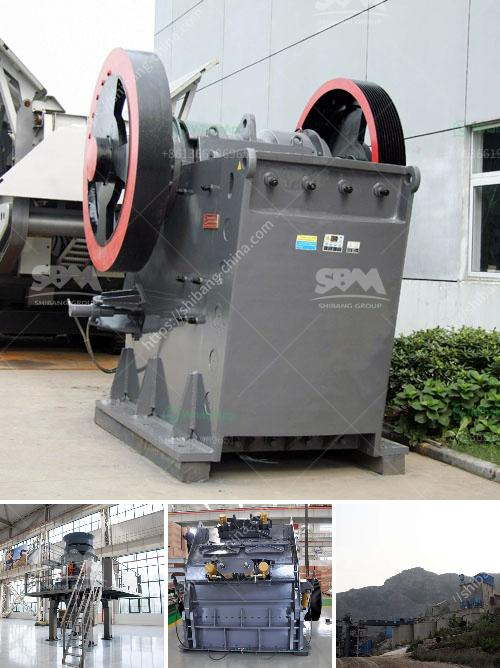

<h3>sp 60x100 jaw crusher</h3>
The SP 60x100 jaw crusher is a versatile machine that is commonly used in mining, construction, and demolition industries for crushing all types of materials. It has a robust construction and operates with a strong jaw design that maximizes productivity and efficiency.

One of the main features of the SP 60x100 jaw crusher is its ability to handle hard rock materials with ease. This makes it ideal for processing ores, minerals, and other hard and abrasive materials. The crusher has a powerful motor that provides a high crushing force, allowing it to break down even the toughest rocks.

The jaw crusher has a large feed opening, which allows it to handle large-sized rocks. This makes it suitable for primary crushing applications. The adjustable jaw setting enables the operator to control the size of the output material, making it possible to achieve the desired end product size.

In terms of operational efficiency, the SP 60x100 jaw crusher delivers excellent results. Its efficient design ensures low energy consumption, minimizing the overall operating costs. Additionally, the crusher is equipped with a dust suppression system, which makes it environmentally friendly and reduces the risk of dust-related health issues for the operators.

Maintenance is also a straightforward process with the SP 60x100 jaw crusher. The machine has easy access to all its components and regular maintenance tasks such as jaw plate replacement can be performed quickly and efficiently. This helps to minimize downtime and ensure maximum productivity.

Another advantage of the SP 60x100 jaw crusher is its compact size. The machine is designed to be easily transported and can be operated in tight spaces. This makes it suitable for various job sites, including urban construction projects where space is limited.

Overall, the SP 60x100 jaw crusher is a reliable and versatile machine that offers high performance and efficiency. Its ability to handle hard rock materials, large feed size, and adjustable jaw setting make it suitable for a range of applications in the mining, construction, and demolition industries. With its low operating costs, easy maintenance, and compact size, it is an excellent choice for any crushing operation.

In conclusion, the SP 60x100 jaw crusher is a powerful and efficient machine that offers excellent performance. Its robust construction, large feed opening, and adjustable jaw setting make it suitable for various applications. Whether it is crushing hard rocks or processing ores, this crusher delivers reliable results. Its low operating costs, easy maintenance, and compact size further add to its appeal. If you are in the market for a jaw crusher, the SP 60x100 is definitely worth considering.
<h3>Contact us</h3><ul><li><strong>Whatsapp:&nbsp;<a href="https://wa.me/8613661969651">+8613661969651</a></strong></li><li><a href="https://swt.shibang-china.com/?git&amp;zhl&amp;sp 60x100 jaw crusher"><strong>Online Service(chat now)</strong></a></li></ul><h3>Related</h3><ul><li><a href='cement clinker grinding plant india.md'>cement clinker grinding plant india</a></li><li><a href='europe quartz stone machinery factory.md'>europe quartz stone machinery factory</a></li><li><a href='linear vibrating screen specifications.md'>linear vibrating screen specifications</a></li><li><a href='calcium carbonate manufacturing plant.md'>calcium carbonate manufacturing plant</a></li><li><a href='smallest cement plant.md'>smallest cement plant</a></li></ul>