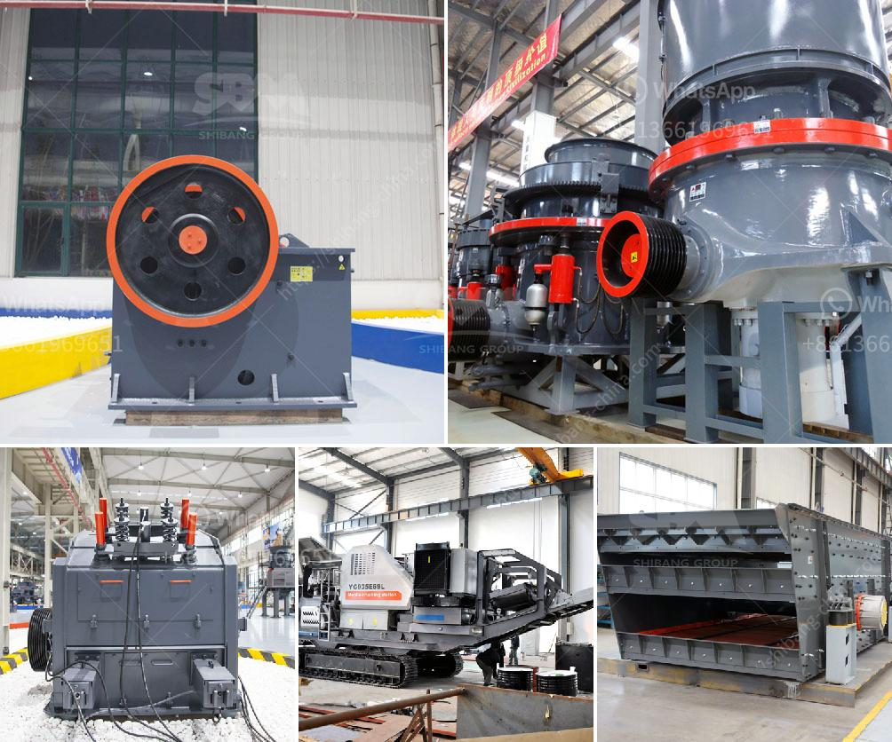

<h3>spare parts cone crushers telesmit cone</h3>
When it comes to crushing equipment, finding the right spare parts quickly is crucial to the operation of any quarry or mining site. Cone crushers are popular rock crushing machines in aggregates production, mining operations, and recycling applications. They are normally used in secondary, tertiary, and quaternary crushing stages. However, in some cases, the cone crusher can also be used as the primary crusher. But even in such cases, it is important to check and replace the spare parts on a regular basis to ensure efficient and safe operation.

One of the critical areas of a cone crusher is the feed opening. This crusher is designed to be efficient and rugged, with an integral counter shaft that can be mounted vertically or horizontally and robust construction for high availability. The cone crusher can crush a variety of ores and rocks with medium hardness and above. But for high hardness stones, such as granite, cone crushers or gyratory crushers are often used, which can increase the wear and tear on the crusher spare parts.

To ensure the normal operation of the cone crusher and avoid excessive wear on the parts, regular maintenance must be carried out. In addition, proper storage and handling of spare parts is also crucial. In this article, we will focus on cone crushers and discuss some common types of cone crusher spare parts available in the market.

Cone crusher spare parts: The cone crusher is a compression type machine that reduces material by squeezing or compressing the feed material between a moving piece of steel and a stationary piece of steel. Different crushing chambers are available with features such as standard, medium, and coarse.

The cone crusher is operated via electrical motor and driven by a belt conveyor, which is widely used in crushing operations, gravel yards, mining, coal mining, concrete mixing plants, dry mortar, power plant desulfurization, quartz sand, etc.

1. Cone Crusher Mantle and Concave Mantle. Cone crushers are used in secondary and tertiary roles as an alternative to impact crushers when shape is an important requirement but the proportion of fines produced needs to be minimized.

2. Crushing Chamber Liners. When it comes to cone crushers, the support ring is an important component that acts as a support for the crushing cone and ensures the proper operation of the equipment.

3. Cone Crusher Bearings: The roller bearing mechanisms and a spherical spider bearing ensure consistent performance, resulting in trouble-free operation. The cone crusher spare parts are specifically designed to suit a wide range of cone crusher models and brands.

4. Cone Crusher Pinion Gear. The pinion shaft, also known as the drive shaft, is responsible for driving the gear if broken, the crusher will not start.

Regularly maintaining the cone crusher is vital in maximizing production and minimizing maintenance cost. Cone crusher maintenance is a crucial step in maintaining the performance and reliability of the crusher equipment. Failure to maintain the wear components in the cone crushers could lead to increased costs due to wear.

If you own a modern cone crusher, the design allows prompt replacement of cone crusher spare parts in a short time. This will help you minimize downtime and reduce production loss. To ensure optimum performance, regularly inspect and replace wear cone crusher parts.
<h3>Contact us</h3><ul><li><strong>Whatsapp:&nbsp;<a href="https://wa.me/8613661969651">+8613661969651</a></strong></li><li><a href="https://swt.shibang-china.com/?git&amp;zhl&amp;spare parts cone crushers telesmit cone"><strong>Online Service(chat now)</strong></a></li></ul><h3>Related</h3><ul><li><a href='quartz silica pulverizer machine.md'>quartz silica pulverizer machine</a></li><li><a href='drums for conveyor belts.md'>drums for conveyor belts</a></li><li><a href='used pulverizer ball mill india.md'>used pulverizer ball mill india</a></li><li><a href='portable cyanide plant gold processing with prices.md'>portable cyanide plant gold processing with prices</a></li><li><a href='stone crushing plant sale.md'>stone crushing plant sale</a></li></ul>