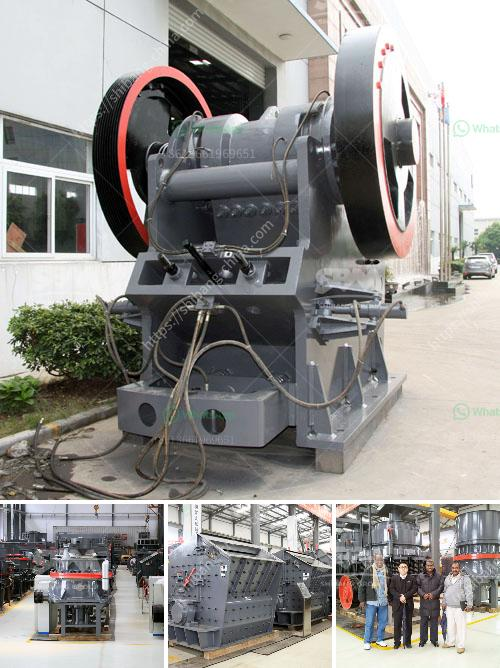

<h3>spare parts for a jaw crusher</h3>
Purchasing spare parts for your crushers is a significant investment. Not only should you ensure their compatibility with your crusher, but you must also consider the overall quality, durability, and reliability of the parts. Jaw crushers are widely used in various industries, including mining, construction, and recycling, due to their ability to crush large chunks of hard materials into smaller pieces. Therefore, having spare parts readily available is crucial to ensure uninterrupted production and minimize downtime.

Spare parts for jaw crushers cover a wide range of components, including the frame, eccentric shaft, bearings, toggle plate, pitman, flywheel, and jaw plate. These vital components are required for proper functioning, smooth operation, and efficient crushing of the material. Each part plays a significant role in the overall performance of the crusher and must be maintained in optimal condition.

When purchasing spare parts for a jaw crusher, it is essential to ensure that they are genuine OEM parts. Genuine parts are specifically designed and manufactured in accordance with the crusher's specifications, ensuring seamless integration and optimal performance. Moreover, genuine spare parts are subjected to rigorous quality control measures, guaranteeing their reliability and longevity.

Choosing high-quality spare parts for your jaw crusher is essential to avoid unnecessary breakdowns and costly downtime. Inferior or poorly manufactured parts may not withstand the pressing forces and wear and tear that crushers experience during operation. Consequently, the use of substandard parts can lead to premature failure, excessive production delays, and increased maintenance costs.

Regular maintenance, including inspections and part replacements, can extend the lifespan of your jaw crusher and prevent unexpected breakdowns. Having spare parts readily available significantly reduces the time needed for repairs, minimizing production interruptions and improving overall efficiency. It is advised to work closely with your equipment provider or authorized dealer to ensure that you have the right spare parts on hand for routine maintenance and emergency situations.

In conclusion, spare parts for jaw crushers are a crucial component for ensuring the smooth operation and longevity of crushers in various industries. Genuine OEM parts, designed specifically for your crusher, provide the best assurance of productivity, reliability, and performance. By investing in high-quality spare parts, you can minimize downtime, maximize productivity, and ultimately, optimize your crusher's efficiency.
<h3>Contact us</h3><ul><li><strong>Whatsapp:&nbsp;<a href="https://wa.me/8613661969651">+8613661969651</a></strong></li><li><a href="https://swt.shibang-china.com/?git&amp;zhl&amp;spare parts for a jaw crusher"><strong>Online Service(chat now)</strong></a></li></ul><h3>Related</h3><ul><li><a href='difference between milling and grinding.md'>difference between milling and grinding</a></li><li><a href='mobile rock crushing plant nigeria.md'>mobile rock crushing plant nigeria</a></li><li><a href='machinery required to setup cement plant.md'>machinery required to setup cement plant</a></li><li><a href='mobile quarry crusher euipment.md'>mobile quarry crusher euipment</a></li><li><a href='price of raymond used for crushing the powder stones.md'>price of raymond used for crushing the powder stones</a></li></ul>