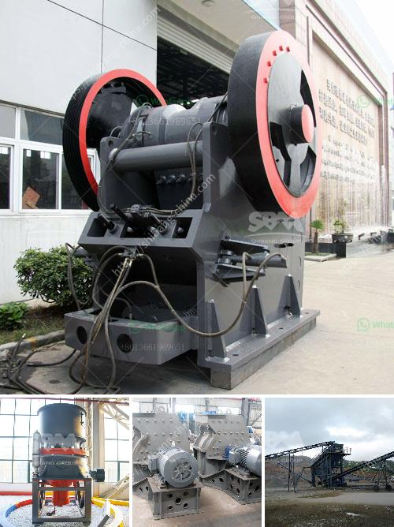

<h3>spare parts rollers xzm ultrafine mill</h3>
The XZM ultrafine mill is a revolutionary piece of machinery that has gained huge popularity in the mining industry. It is known for its exceptional performance and efficiency in grinding various types of materials into ultra-fine powders. One crucial component of the XZM ultrafine mill that ensures its smooth operation is the spare parts rollers.

The spare parts rollers of the XZM ultrafine mill play a vital role in the overall functionality of the machinery. These rollers are responsible for grinding and crushing the materials to the desired fineness. They are made of high-quality materials to ensure durability and longevity in the demanding mining environment.

One notable feature of the spare parts rollers of the XZM ultrafine mill is their versatility. They can be easily adjusted to accommodate different materials and grinding requirements. This flexibility enables the mill to deliver consistent and precise results, regardless of the material being processed.

Furthermore, the spare parts rollers are designed to withstand heavy loads and high pressures. They are engineered to efficiently handle the intense grinding process without experiencing significant wear and tear. This durability minimizes downtime and maintenance costs, allowing for continuous and uninterrupted production.

In the event of worn-out or damaged rollers, the availability of spare parts is crucial. Fortunately, the manufacturers of the XZM ultrafine mill understand the importance of readily available spare parts. Spare parts rollers for the XZM ultrafine mill can be easily sourced and replaced, ensuring swift repairs and minimal disruption to operations.

Overall, the spare parts rollers of the XZM ultrafine mill are an essential component that contributes to its exceptional performance and efficiency. Their durability, versatility, and availability make them a valuable investment for any mining operation. With these rollers, the XZM ultrafine mill stands as a reliable and efficient solution for grinding various materials into ultra-fine powders.
<h3>Contact us</h3><ul><li><strong>Whatsapp:&nbsp;<a href="https://wa.me/8613661969651">+8613661969651</a></strong></li><li><a href="https://swt.shibang-china.com/?git&amp;zhl&amp;spare parts rollers xzm ultrafine mill"><strong>Online Service(chat now)</strong></a></li></ul><h3>Related</h3><ul><li><a href='gravel crusher supplier in the philippines.md'>gravel crusher supplier in the philippines</a></li><li><a href='dolomite crushers for sale.md'>dolomite crushers for sale</a></li><li><a href='100 tph stone crusher plant specifications.md'>100 tph stone crusher plant specifications</a></li><li><a href='tertiary impact crushers for quartz.md'>tertiary impact crushers for quartz</a></li><li><a href='talc powder importer in europe.md'>talc powder importer in europe</a></li></ul>