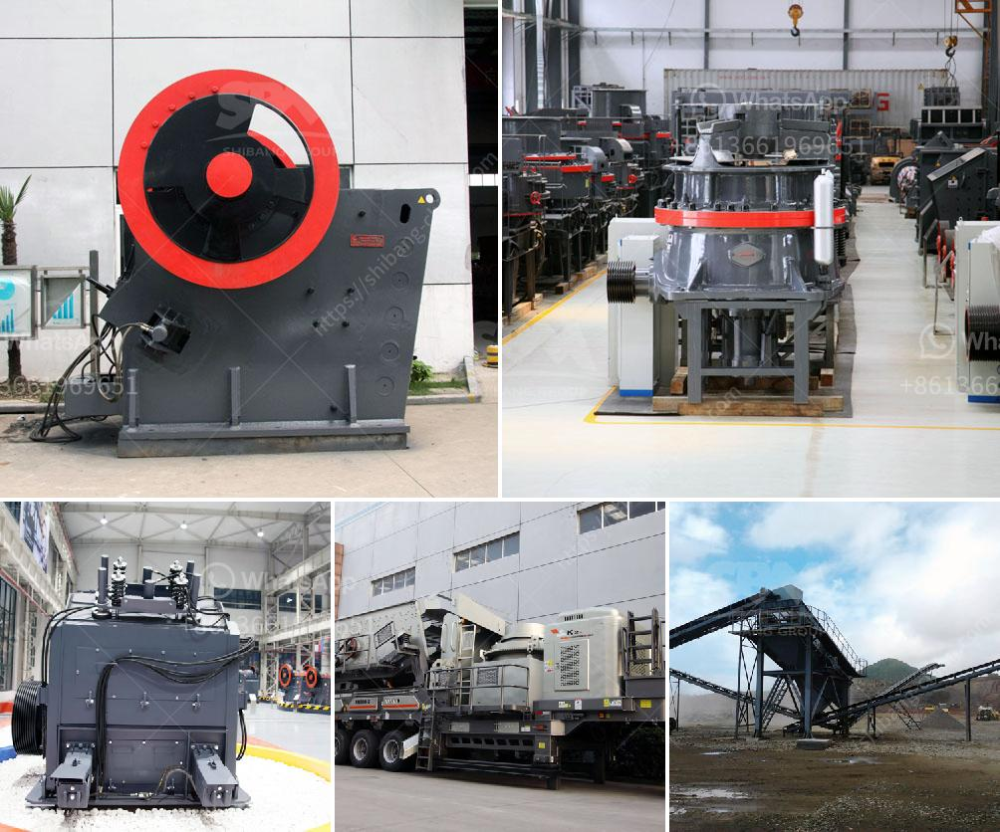

<h3>specification jaw crusher</h3>
A jaw crusher is a necessary machine in the construction industry. It plays a vital role in the crushing process, as it breaks down stones into smaller pieces. Jaw crushers are often used for primary crushing and are perhaps the most popular crushers worldwide. These compressive crushers are suitable for most any type of material.

In this article, we will be discussing the specifications of jaw crushers. There are different types of jaw crushers available, each with its own set of specifications. Let's take a closer look at them.

Firstly, we have the Blake jaw crushers. These machines are characterized by a swing jaw plate that moves back and forth to crush rocks. The single-toggle design is simple and straightforward, making it ideal for small and medium-sized operations. The Blake jaw crushers are known for their high capacity and low maintenance.

Secondly, we have the overhead eccentric jaw crushers. This type of crusher has a fixed jaw and a moving jaw pivoted in the upper part of the crusher. Both jaws are lined with replaceable manganese jaw liners. The moving jaw plate applies the force of impact on particles held against the stationary plate.

Next, we have the double toggle jaw crushers. These crushers are similar to the overhead eccentric ones, but have a toggle plate that provides a mechanical advantage for the crushing process. This design produces a significantly higher crushing force compared to the other types, resulting in finer product size and better shape.

Lastly, we have the hydraulic jaw crushers. These crushers use hydraulic cylinders to crush rocks and adjust the discharge opening. They are commonly used for primary crushing and operate at a high capacity. The hydraulic system allows for easy adjustments to the crusher setting and protects the crusher from overloading.

When considering the specifications of a jaw crusher, there are certain important factors to consider. The size of the jaw crusher refers to the feed opening width and depth. These dimensions can vary depending on the specific application and requirements. It is important to choose a jaw crusher that is suitable for the size of the material being crushed.

Another crucial specification is the crusher's capacity. This refers to the maximum amount of material that the crusher can process in a specific time period. It is determined by factors such as the type of material, the feed size, and the required final product size. Choosing a jaw crusher with the appropriate capacity ensures efficient processing and prevents the crusher from becoming overloaded.

Other specifications to consider include the power requirements, the speed at which the crusher operates, and the maintenance requirements. These factors can vary depending on the specific make and model of the jaw crusher.

In conclusion, jaw crushers are essential machines in the construction industry. They are versatile and can handle a wide variety of materials. When selecting a jaw crusher, it is important to consider factors such as the size of the feed opening, the capacity, and the specific requirements of the application. By choosing a well-designed crusher with the appropriate specifications, you can ensure efficient and effective crushing operations.
<h3>Contact us</h3><ul><li><strong>Whatsapp:&nbsp;<a href="https://wa.me/8613661969651">+8613661969651</a></strong></li><li><a href="https://swt.shibang-china.com/?git&amp;zhl&amp;specification jaw crusher"><strong>Online Service(chat now)</strong></a></li></ul><h3>Related</h3><ul><li><a href='silica sand pulverizer.md'>silica sand pulverizer</a></li><li><a href='alluvial wash plants in south africa.md'>alluvial wash plants in south africa</a></li><li><a href='hammer mill technical specification.md'>hammer mill technical specification</a></li><li><a href='how to calculate coal mill capacity for cement plant.md'>how to calculate coal mill capacity for cement plant</a></li><li><a href='ball mill vibration limits.md'>ball mill vibration limits</a></li></ul>