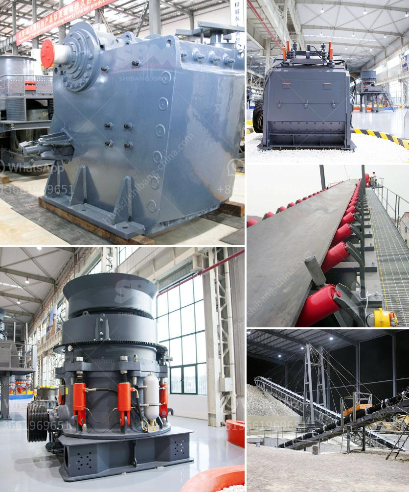

<h3>speed of vibrating screen</h3>
The speed of a vibrating screen is an important factor that affects its efficiency and performance. The purpose of this article is to provide some insights into the importance of screen speed and its impact on the overall screening process.

The speed of a vibrating screen refers to the frequency at which the screen is driven. It is measured in revolutions per minute (RPM) and determines the acceleration rate of the material on the screen. The higher the speed of the screen, the faster the material will travel across the screening surface, resulting in a shorter residence time of the particles. Conversely, a lower screen speed will result in a longer residence time.

One of the key benefits of adjusting the screen speed is the ability to control the material stratification on the deck surface. Stratification is the separation of particles according to their size and density. By optimizing the screen speed, operators can effectively control the stratification process, ensuring that the finer particles are able to pass through the screen openings while the coarser ones remain on the surface.

Another significant advantage of adjusting the screen speed is the ability to fine-tune the screening efficiency. Different materials require different screen speeds to achieve optimal separation. For instance, fine materials with smaller particle sizes tend to require higher screen speeds to improve screening efficiency. On the other hand, larger materials may require lower screen speeds to prevent excessive bounce and blinding of the screen openings.

Screen speed also influences the capacity of the vibrating screen. Higher speeds generally result in a higher throughput rate, as more material is able to pass through the screen in a given amount of time. However, it is important to strike a balance between speed and efficiency, as excessively high speeds can lead to material turbulence and reduced effectiveness of the screening process.

In addition to material characteristics, the screen speed is also influenced by factors such as screen length, inclination, and stroke. These factors must be taken into consideration when selecting and operating a vibrating screen to ensure optimal performance.

It is worth noting that screen speed is not the sole factor that determines the efficiency of a vibrating screen. Other factors such as screen inclination, amplitude, and frequency also play critical roles in the screening process. Therefore, it is essential to consider these factors in conjunction with screen speed to achieve the desired screening performance.

In summary, the speed of a vibrating screen is a crucial parameter that affects its overall performance. By adjusting the screen speed, operators can control material stratification, improve screening efficiency, and optimize the capacity of the screening process. It is important to note that screen speed should be considered in conjunction with other factors to achieve optimal results.
<h3>Contact us</h3><ul><li><strong>Whatsapp:&nbsp;<a href="https://wa.me/8613661969651">+8613661969651</a></strong></li><li><a href="https://swt.shibang-china.com/?git&amp;zhl&amp;speed of vibrating screen"><strong>Online Service(chat now)</strong></a></li></ul><h3>Related</h3><ul><li><a href='hammer mill dealer in cebu.md'>hammer mill dealer in cebu</a></li><li><a href='ton hour coal crusher and screen.md'>ton hour coal crusher and screen</a></li><li><a href='used sand screening plant for sale in uae.md'>used sand screening plant for sale in uae</a></li><li><a href='bush crusher machine.md'>bush crusher machine</a></li><li><a href='coal crushing plant.md'>coal crushing plant</a></li></ul>