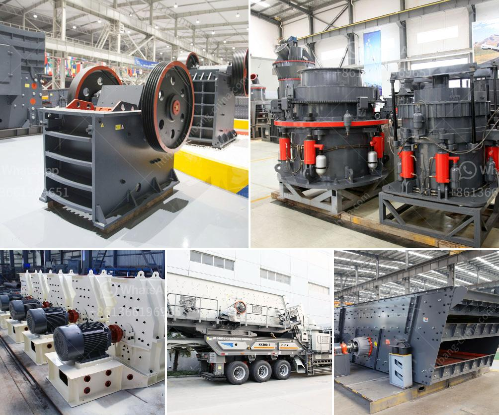

<h3>stamp mill for sale in zimbabwe</h3>
Stamp mill, also known as grinding mill, is a type of mill machine that crushes material by pounding rather than grinding. It is widely used in industries such as mining and construction, where it is necessary to crush and grind large material into a smaller size. Stamp mills are available in various sizes and capacities, ranging from small stamp mills for sale in Zimbabwe to large stamp mills for sale in Zimbabwe.

Stamp mills are useful in crushing ore and extracting gold from the hard rock. They are also used in various industries, including the construction and metallurgy industries, to grind materials such as rock, cement, and limestone.

One of the key benefits of using a stamp mill is that it provides a relatively cost-effective way to process ore on a large scale. Stamp mills are especially valuable in countries like Zimbabwe, where access to traditional mining areas is limited due to inaccessibility or a lack of infrastructure.

When looking for stamp mills for sale in Zimbabwe, it is essential to ensure that the equipment is of high quality and meets industry standards. Many reliable manufacturers offer stamp mills for sale that are durable and efficient, ensuring optimal performance even in demanding environments. These stamp mills are typically made of robust materials, such as steel, and are engineered to withstand heavy-duty operations.

Stamp mills for sale in Zimbabwe are widely used in mining, construction, metallurgy, and other industries. It is also a crucial equipment for processing gold and other precious metals. In Zimbabwe, there are plenty of mine tailings discarded from previous mining operations that still contain a significant amount of gold. By using a stamp mill, these tailings can be processed and the gold extracted, generating valuable income.

In conclusion, stamp mills are a valuable tool for extracting gold and other minerals from the hard rock. They offer a cost-effective and efficient solution for mining operations in Zimbabwe and other regions. When considering stamp mills for sale in Zimbabwe, it is crucial to choose reliable manufacturers and opt for high-quality equipment to ensure optimal performance and longevity.
<h3>Contact us</h3><ul><li><strong>Whatsapp:&nbsp;<a href="https://wa.me/8613661969651">+8613661969651</a></strong></li><li><a href="https://swt.shibang-china.com/?git&amp;zhl&amp;stamp mill for sale in zimbabwe"><strong>Online Service(chat now)</strong></a></li></ul><h3>Related</h3><ul><li><a href='minerio de maquina de lavar maquina de lavar mineral.md'>minerio de maquina de lavar maquina de lavar mineral</a></li><li><a href='primary crusher machine.md'>primary crusher machine</a></li><li><a href='grinding mill machines in south africa.md'>grinding mill machines in south africa</a></li><li><a href='silica sand production using ball mill in dubai.md'>silica sand production using ball mill in dubai</a></li><li><a href='small 100 ton rock crushing machine.md'>small 100 ton rock crushing machine</a></li></ul>