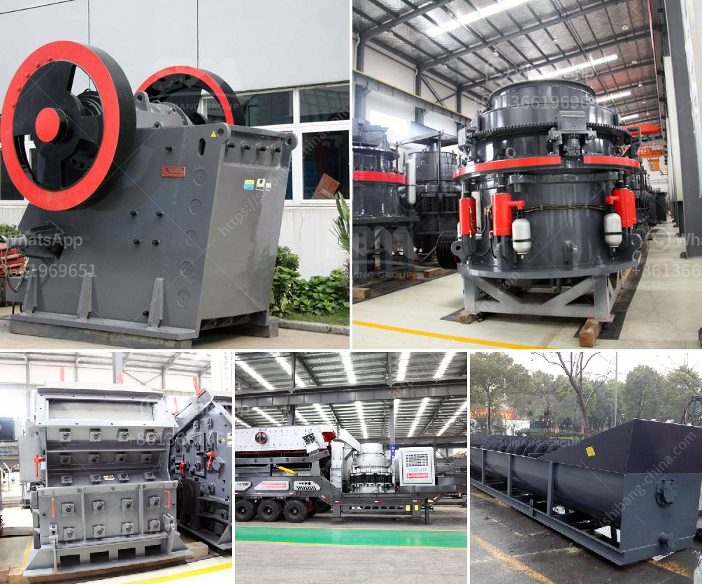

<h3>stamp mill machine south africa</h3>
The Stamp Mill Machine in South Africa is well-known for its long history, and rich tradition in gold mining. Dating back to the early days of the country, stamp mills were used extensively in gold mining and processing. Due to their ability to crush, refine, and extract gold, stamp mills have long been a popular choice among miners.

The Stamp Mill Machine in South Africa is the key equipment for crushing materials, providing gold producers with finely crushed gold ore. Gold ore crusher from the gold ore-bearing veins or broken gold bearing material, gold stamp mill machine is widely used in various industries, such as mining, metallurgy, building materials, highway, railway, water conservancy, and chemical industry, etc.

Stamp mills have been used in gold mining for decades. Crushing is accomplished by the stamp mill, which contains a heavy steel cylinder compressed against a rock by a piston, crushing and grinding the rock. The crushed rock is then further processed by using chemicals to extract the gold from the ore.

The Stamp Mill Machine has evolved through the years to become more efficient and productive in processing gold ore. New designs and techniques have allowed for better extraction of gold, resulting in higher yields for miners. This has made stamp mills a valuable tool in gold mining operations.

In addition to their use in gold mining, stamp mills have also been used in other industries. For example, stamp mills were commonly used in paper mills to crush and refine pulp for making paper. The stamp mill machine was also used in crushing ore in some metal mines. Stamp mills were commonly used in hydraulic gold mining.

South Africa has a rich history in gold mining, dating back to the 1880s when the first gold reef was discovered in Witwatersrand. Over the years, gold mining has been a major industry in South Africa, contributing greatly to the country's economy and providing employment to many people.

The Stamp Mill Machine has played a significant role in the history of gold mining in South Africa. It has allowed miners to process large quantities of gold-bearing rock, significantly increasing their chances of finding gold. Even today, stamp mills are still used by small-scale miners, providing them with an affordable and efficient way to process gold ore.

In conclusion, the Stamp Mill Machine in South Africa has a long and rich history in the gold mining industry. It has revolutionized the way gold ore is processed, allowing for better extraction and higher yields. Stamp mills continue to be used by miners today, making a valuable contribution to the mining industry in South Africa.
<h3>Contact us</h3><ul><li><strong>Whatsapp:&nbsp;<a href="https://wa.me/8613661969651">+8613661969651</a></strong></li><li><a href="https://swt.shibang-china.com/?git&amp;zhl&amp;stamp mill machine south africa"><strong>Online Service(chat now)</strong></a></li></ul><h3>Related</h3><ul><li><a href='small jaw crusher uk.md'>small jaw crusher uk</a></li><li><a href='safety poster for coal handling plant.md'>safety poster for coal handling plant</a></li><li><a href='rock crusher unit.md'>rock crusher unit</a></li><li><a href='used construction machinery rates in pakistan.md'>used construction machinery rates in pakistan</a></li><li><a href='mobile jaw crusher for sale india used price.md'>mobile jaw crusher for sale india used price</a></li></ul>