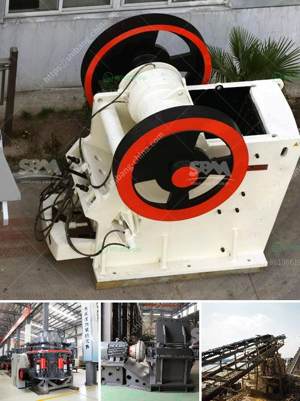

<h3>standard cone crusher</h3>
A standard cone crusher is utilized for secondary or tertiary crushing of materials. The cone crusher breaks rocks by squeezing them between an eccentrically gyrating cone and a concave. Although the same basic principles are used in both types of cone crushers, the design of the standard cone crusher allows for a larger feed rock and a finer product size. In addition, the standard cone crusher has a large head angle, coarser mantle, and a larger feed opening, making it capable of processing larger feed materials. 

The standard cone crusher works by squeezing the materials between an eccentrically gyrating cone and a concave. The crushing chamber is designed to be parallel, with a constant gap between the crushing surfaces. The moving cone (mantle) and the concave liners are mounted on a main shaft that rotates at a fixed speed. As the materials enter the crusher, they are crushed between the mantle and concave, and the crushed materials are discharged through the discharge opening at the bottom.

1. Versatility: The standard cone crusher is suitable for various crushing applications, including limestone, granite, and basalt. It can be used as a secondary or tertiary crusher.

2. Higher capacity: Compared to other types of crushers, the standard cone crusher has a higher crushing capacity. This is due to its larger feed opening and coarser mantle, which allows it to process larger feed materials effectively.

3. Improved particle shape: The design of the standard cone crusher contributes to a better particle shape, resulting in a more cubical product. This is highly desirable for producing high-quality aggregates for construction and road building.

4. Lower operational costs: The standard cone crusher requires less maintenance compared to other crushers. This results in lower operational costs and increased profitability for the operator.

5. Easy to operate and maintain: The standard cone crusher is straightforward to operate and maintain. It features a user-friendly interface, allowing operators to quickly understand its operation and make necessary adjustments.

The standard cone crusher is widely used in various industries, including mining, construction, and aggregate processing. It is commonly used for secondary or tertiary crushing of hard rock materials.

The standard cone crusher is a reliable and versatile crusher, capable of crushing a variety of materials. With its larger feed opening, coarser mantle, and higher crushing capacity, it is suitable for both secondary and tertiary crushing applications. Its ease of operation and maintenance, along with its ability to produce a cubical particle shape, make it a preferred choice for many operators. Whether it is for mining, construction, or aggregate processing, the standard cone crusher has proven its effectiveness and efficiency in various industries.
<h3>Contact us</h3><ul><li><strong>Whatsapp:&nbsp;<a href="https://wa.me/8613661969651">+8613661969651</a></strong></li><li><a href="https://swt.shibang-china.com/?git&amp;zhl&amp;standard cone crusher"><strong>Online Service(chat now)</strong></a></li></ul><h3>Related</h3><ul><li><a href='gravel crushers in bc.md'>gravel crushers in bc</a></li><li><a href='price list ball mill equipment.md'>price list ball mill equipment</a></li><li><a href='stone manufacturing process.md'>stone manufacturing process</a></li><li><a href='ball mill mexico.md'>ball mill mexico</a></li><li><a href='raymond pulverizer mill pdf.md'>raymond pulverizer mill pdf</a></li></ul>