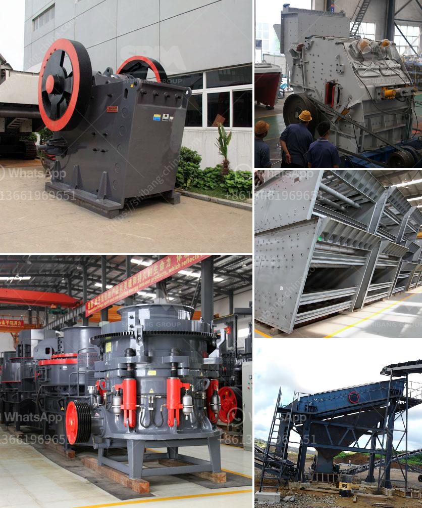

<h3>standard crushed stone sizes</h3>
Crushed stone is an essential component of many construction projects as it provides the base layer for roadways, sidewalks, and foundations. The size distribution of crushed stone allows it to compact and interlock, providing a stable and durable surface. Understanding the different sizes of crushed stone available can help you choose the right material for your specific project.

Crushed stone is typically produced from limestone, granite, or trap rock. The stone is crushed down to various sizes based on its intended use. The most common sizes for crushed stone are:

These sizes are based on the dimensions of the smallest and largest pieces of stone in each grade. The size number corresponds to the approximate diameter of the individual stones.

Each size of crushed stone has different applications in the construction industry. Here are some common uses for different sizes:

- Size #10: This small size is often used as a top layer in driveways, walkways, and patios. It provides a smooth and aesthetically pleasing surface.

- Size #67 and Size #411: These sizes are commonly used as base materials for roadways, parking lots, and foundations. They provide stability and drainage.

- Size #57: This size is commonly used in concrete and asphalt mixes as well as for drainage purposes, such as French drains or septic system bedding.

- Size #304: This larger size is often used for situations requiring increased stability, such as lining ditches or as a base for heavy equipment.

When selecting the appropriate crushed stone size for your project, there are a few factors to consider:

- Intended use: Determine the purpose of your project and choose a size that best suits your needs. Consider factors such as load-bearing capacity, drainage requirements, and aesthetic preferences.

- Availability: Check with local suppliers to ensure that the desired size is readily available in your area.

- Cost: Larger sizes tend to be more expensive than smaller sizes due to the increased amount of material needed for the same coverage area. Consider your budget when making a decision.

- Durability: Crushed stone provides a strong and stable surface that can withstand heavy loads and resist erosion.

- Drainage: The interlocking properties of crushed stone allow for efficient water drainage, preventing standing water and reducing the risk of erosion.

- Aesthetics: The variety of sizes and colors of crushed stone allows for customization and enhances the visual appeal of your project.

- Cost-effectiveness: Crushed stone is a cost-effective option, especially for larger projects, as it requires minimal maintenance and has a long lifespan.

In conclusion, understanding the different standard sizes of crushed stone is essential for selecting the right material for your construction project. Each size has its own unique applications and benefits. By considering factors such as intended use, availability, and cost, you can make an informed decision and ensure the success of your project.
<h3>Contact us</h3><ul><li><strong>Whatsapp:&nbsp;<a href="https://wa.me/8613661969651">+8613661969651</a></strong></li><li><a href="https://swt.shibang-china.com/?git&amp;zhl&amp;standard crushed stone sizes"><strong>Online Service(chat now)</strong></a></li></ul><h3>Related</h3><ul><li><a href='stone crusher for sale in uae.md'>stone crusher for sale in uae</a></li><li><a href='barite washing equipment.md'>barite washing equipment</a></li><li><a href='safety videos of belt conveyors in hindi.md'>safety videos of belt conveyors in hindi</a></li><li><a href='100 ton hour crushing.md'>100 ton hour crushing</a></li><li><a href='feldspar powder making.md'>feldspar powder making</a></li></ul>