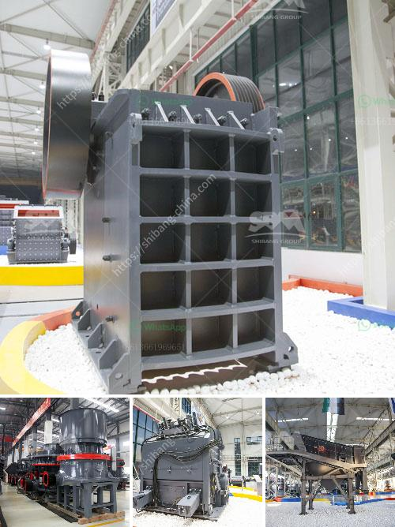

<h3>standard operating procedure for coal pulverizer</h3>
A coal pulverizer plays a crucial role in the coal-fired power generation process. It is responsible for grinding and drying the coal, thus making it suitable for combustion. This article comprehensively details the standard operating procedure for coal pulverizer operation, highlighting key aspects and best practices to ensure safe and efficient operation.

1. Before starting the pulverizer, ensure all operators are familiar with the control panel and emergency shutdown procedure.

2. Review the previous shift's reports to understand any abnormalities or issues encountered during their operation. Address and rectify these concerns.

1. Inspect the coal pulverizer for any signs of damage, wear, or misalignment. Ensure all parts, including hammers, liners, classifier blades, and the grinding roll assembly, are in optimal condition. Replace worn-out parts promptly.

3. Check the grinding zone airflow and temperature to ensure they fall within the recommended limits.

3. Gradually open the primary air damper to the required level, allowing coal to enter the pulverizer mill.

4. Monitor the pulverizer power consumption and mill outlet temperature to ensure safe and efficient operation.

1. Maintain the desired coal feed rate to the mill. Adjust the coal flow control valve as required to achieve the desired fineness and fuel distribution.

2. Monitor the grinding pressure and classifier speed to optimize the coal fineness. Adjust these parameters if necessary to ensure the desired product quality.

3. Continuously monitor the mill outlet temperature. If it deviates from the acceptable range, adjust the primary air damper to stabilize the temperature.

1. Gradually reduce the coal feed rate, ensuring the pulverizer remains in operation for a sufficient time to cool down.

2. Once the coal feed rate is minimal, temporarily shut down the cooling water and purge the pulverizer with inert gas to minimize fire and explosion risks.

3. Gradually reduce the primary air damper position to zero, ceasing the coal flow and shutting down the pulverizer.

4. Once the pulverizer is completely cooled, inspect the grinding elements and other components for any signs of damage or wear.

1. Regularly clean the coal pulverizer to remove coal dust and debris, ensuring proper airflow and heat transfer performance.

2. Perform routine maintenance tasks such as lubrication, alignment checks, and drive system inspections as per the manufacturer's recommendations.

3. Ensure all safety devices, such as fire detection and suppression systems, are functioning correctly and are regularly tested.

Adhering to a standard operating procedure for coal pulverizer operation is vital to ensure the safe and efficient functioning of coal-fired power plants. Regular inspections, proper maintenance, and adherence to best practices will enhance the overall performance and longevity of the coal pulverizer. It is crucial to train operators thoroughly and keep them up to date with the latest safety procedures to minimize risks and enhance operational efficiency.
<h3>Contact us</h3><ul><li><strong>Whatsapp:&nbsp;<a href="https://wa.me/8613661969651">+8613661969651</a></strong></li><li><a href="https://swt.shibang-china.com/?git&amp;zhl&amp;standard operating procedure for coal pulverizer"><strong>Online Service(chat now)</strong></a></li></ul><h3>Related</h3><ul><li><a href='how to process quartz ore crusher.md'>how to process quartz ore crusher</a></li><li><a href='tertiary impact crushers for quartz.md'>tertiary impact crushers for quartz</a></li><li><a href='manufacturer of talc powder in uae.md'>manufacturer of talc powder in uae</a></li><li><a href='second hand crusher to buy in zambia.md'>second hand crusher to buy in zambia</a></li><li><a href='mobile stone crushers.md'>mobile stone crushers</a></li></ul>