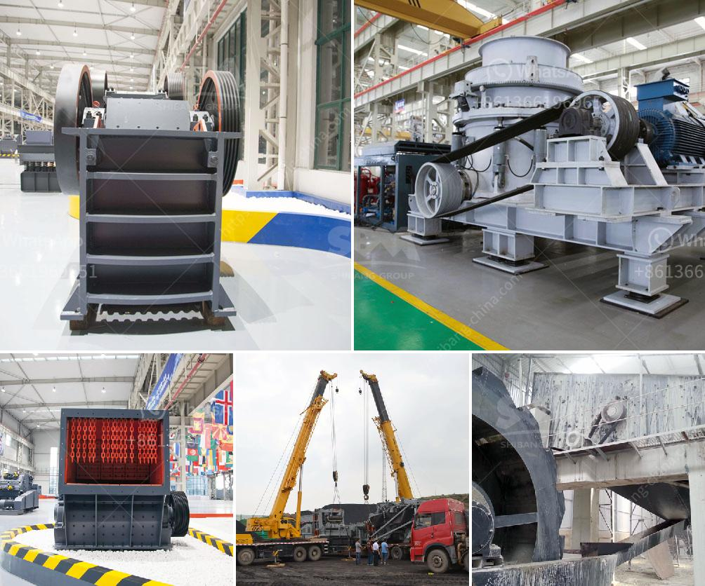

<h3>start up granite quarry business</h3>
Starting a granite quarry business can be a lucrative and profitable venture for entrepreneurs looking to make a mark in the industry. But, just like any other business, it is important to plan and strategize before getting started. Here is a comprehensive guide to help you start your own granite quarry business.

Before venturing into the granite quarry business, it is crucial to conduct a thorough research and feasibility study. This step will help you understand the market demand, competition, and potential profitability of your venture. Analyze the market trends, target customer base, and industry regulations. Additionally, identify and assess your potential competitors, including their pricing, quality, and delivery methods. This research will enable you to make informed decisions and develop a sustainable business plan.

Choosing the right location and site for your granite quarry is crucial to the success of your business. Look for areas that have a high demand for granite products and sufficient supply of raw materials. Consider infrastructure, accessibility, and proximity to your target market. You may also need to acquire the necessary permits and licenses from local authorities before setting up your quarry. A well-thought-out site selection will ensure smooth operations and cost-effective transportation of raw materials and finished products.

Starting a granite quarry business requires significant investment in land, machinery, and equipment, among other things. Calculate your initial investment and create a detailed business plan that outlines how you will secure funding. Consider applying for loans from banks or seeking investment from potential partners or sponsors. Having a clear financial plan will help you secure funds and allocate them efficiently.

To run a successful granite quarry business, you will need specialized equipment and machinery. This may include excavators, loaders, crushers, and diamond wire saws, among others. Make sure to purchase high-quality and reliable equipment to ensure smooth and efficient operations. Consider leasing or purchasing used machinery if it aligns with your budget and needs. Consult with industry experts to determine the best equipment for your quarry.

The success of any business greatly depends on its workforce. Hire skilled and experienced staff members who have knowledge of quarry operations. Those with experience in the mining and construction industry can be valuable assets to your business. Ensure that your employees understand workplace safety protocols and adhere to industry regulations.

Develop a comprehensive marketing and sales strategy to promote your granite quarry business effectively. Utilize various channels such as online platforms, social media, and trade shows to reach potential customers. Create a strong brand identity and emphasize the quality of your granite products. Deliver exceptional customer service to build long-term relationships with clients. Consider offering competitive pricing and discounts to attract new customers.

Starting a granite quarry business requires careful planning, financial investment, and strong operational strategies. By conducting thorough research, securing funding, and acquiring the right equipment, you can establish a successful and profitable venture in the industry. With dedication, hard work, and a customer-centric approach, your granite quarry business can thrive and make a mark in the market.
<h3>Contact us</h3><ul><li><strong>Whatsapp:&nbsp;<a href="https://wa.me/8613661969651">+8613661969651</a></strong></li><li><a href="https://swt.shibang-china.com/?git&amp;zhl&amp;start up granite quarry business"><strong>Online Service(chat now)</strong></a></li></ul><h3>Related</h3><ul><li><a href='technical parametres of impact crusher.md'>technical parametres of impact crusher</a></li><li><a href='jaw crusher type sp 100 x.md'>jaw crusher type sp 100 x</a></li><li><a href='crushers price in south africa product.md'>crushers price in south africa product</a></li><li><a href='portable sand washing machine.md'>portable sand washing machine</a></li><li><a href='vertical vertical roller mill.md'>vertical vertical roller mill</a></li></ul>