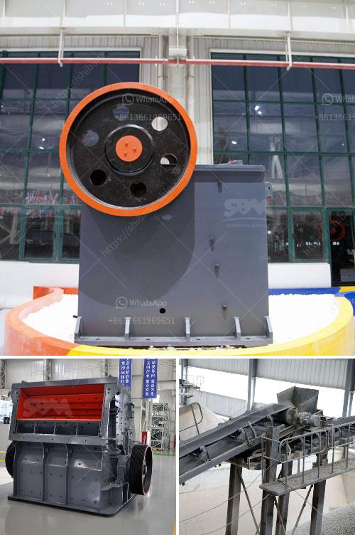

<h3>static jaw crusher</h3>
A static jaw crusher is essentially a primary crushing machine used for reducing the size of rocks and stones. Compared to portable stone crushers, static crushers are designed to be more stable and rigid, making them suitable for long-term use. Static crushers have fixed openings, which allow the exact size of the material to be processed. This results in more consistent end products.

One of the key benefits of a static jaw crusher is its impressive durability and strong construction. Built with heavy-duty materials, these crushers can withstand the intense pressure exerted by rocks and stones. This robustness ensures that the static jaw crusher can handle various types of materials, including the toughest ones. Additionally, the heavy-duty construction minimizes frequent maintenance and repairs, reducing downtime and maximizing productivity.

The design of a static jaw crusher also promotes efficient crushing performance. The fixed jaw plate is strategically placed, ensuring uniformity in the gradation of the crushed materials. This consistency allows for better control of the final product's size, shape, and quality. Whether it is a fine sand or coarse aggregate, a static jaw crusher ensures that the output meets the required specifications.

With its simple structure and straightforward operation, a static jaw crusher is also easy to maintain and operate. The lack of complex mechanisms eliminates the need for frequent adjustments, resulting in better efficiency and increased productivity. Operators can also easily inspect and access critical parts, facilitating quicker troubleshooting and maintenance.

Moreover, a static jaw crusher can be customized to fit specific site requirements. It can be designed with different feed sizes and capacities, depending on the anticipated workload. This versatility allows businesses to choose the static crusher that best matches their production needs. It also ensures that the crusher can adapt to future changes in the demand for different materials.

In terms of operational costs, a static jaw crusher offers several advantages. Firstly, it consumes less power compared to other types of crushers. This translates into energy savings, reducing electricity bills. Secondly, static jaw crushers have low wear and tear, requiring fewer spare parts and minimizing maintenance expenses. Furthermore, static jaw crushers have a longer lifespan, meaning they can be used for many years without needing replacement.

In conclusion, a static jaw crusher is an excellent investment for businesses involved in mining, construction, or aggregates production. Its durability, efficiency, and versatility make it a reliable choice for reducing rocks and stones to the desired size. Whether processing limestone, granite, or other materials, a static jaw crusher ensures consistent quality of the end product. With its low operational costs and easy maintenance, a static jaw crusher can significantly contribute to a company's profitability and growth.
<h3>Contact us</h3><ul><li><strong>Whatsapp:&nbsp;<a href="https://wa.me/8613661969651">+8613661969651</a></strong></li><li><a href="https://swt.shibang-china.com/?git&amp;zhl&amp;static jaw crusher"><strong>Online Service(chat now)</strong></a></li></ul><h3>Related</h3><ul><li><a href='ballast quarry equipment supplies.md'>ballast quarry equipment supplies</a></li><li><a href='jaw crusher for sale in saudi.md'>jaw crusher for sale in saudi</a></li><li><a href='trommel wash plant suppliers pakistan.md'>trommel wash plant suppliers pakistan</a></li><li><a href='nigeria rock crushing plant.md'>nigeria rock crushing plant</a></li><li><a href='silica sand production using ball mill in dubai.md'>silica sand production using ball mill in dubai</a></li></ul>