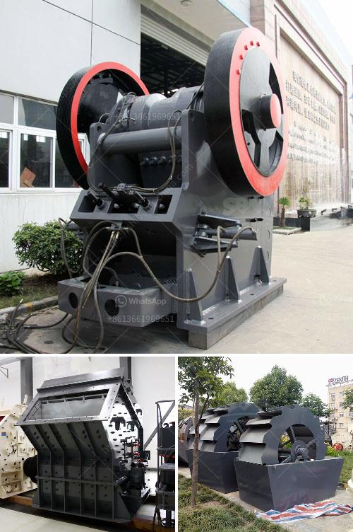

<h3>stone crush machine pakistan price</h3>
Stone crush machine is a vital part of Pakistan's construction industry. It plays a significant role in raw material crushing to help provide better quality and sustainable infrastructure development in the country. Pakistan has approximately 2,646 stone crushing units, consisting of various sizes and shapes. These machines efficiently break down the raw materials into smaller rocks or stones, which are then used for construction purposes.

The stone crush machines are commonly used in mines, metallurgy, building materials, highways, railways, water conservancy, and chemical industries. The stone crushing production line in Pakistan plays a vital role in the export of mining equipment. It lays a solid foundation for the country's infrastructure construction, and also propels economic growth.

When investing in a stone crushing machine, the price depends on the performance of the machine and its production capacity. The stone crushers, especially the robust ones, can significantly reduce costs and expenses. These machines have a wide range of capacities, which can vary from as low as 50 tons per hour to 500 tons per hour. The stone crusher machine can be used in various engineering purposes, such as highways, buildings, and bridges construction.

The price of a stone crush machine depends on many factors, including the production capacity, equipment configuration, and the specific crusher model. A higher capacity means higher price. It is suggested to choose a machine with a reasonable capacity that can meet your production needs efficiently.

Another factor to consider when purchasing a stone crush machine is the quality of the machine. High-quality machines guarantee longer service life and better performance. They can withstand different types of materials and working environments, ensuring minimal maintenance and repairing costs. It is advisable to opt for machines made from quality materials, such as high-quality steel and reinforced components.

The stone crush machine's price also depends on the brand. Different brands offer machines with different features and specifications. Some brands are known for their robustness and durability, while others may offer more advanced technology or better after-sales services. Researching reputable brands and comparing their prices can help you make an informed decision.

Government policies and regulations can also influence the price of stone crushing machines. The Pakistani government has put in place regulations and standards to ensure the safety and environmental protection of these machines. Compliance with these regulations can increase the cost of production, ultimately affecting the price of the machine.

Lastly, it is essential to consider the after-sales services provided by the manufacturer. Choosing a manufacturer that offers comprehensive after-sales services, such as installation, training, and maintenance, can ensure the smooth operation of the machine. Prompt technical support and spare parts availability are crucial for minimizing downtime and increasing productivity.

In conclusion, the stone crush machine price in Pakistan largely depends on the factors mentioned above. The higher the capacity and quality of the machine, the higher the price. Higher prices imply higher durability and better performance. It is recommended to conduct thorough research, compare prices, and consider after-sales services before making a purchase. Investing in a high-quality stone crushing machine allows for long-term cost savings and contributes to the construction industry's growth and development in Pakistan.
<h3>Contact us</h3><ul><li><strong>Whatsapp:&nbsp;<a href="https://wa.me/8613661969651">+8613661969651</a></strong></li><li><a href="https://swt.shibang-china.com/?git&amp;zhl&amp;stone crush machine pakistan price"><strong>Online Service(chat now)</strong></a></li></ul><h3>Related</h3><ul><li><a href='small ball mill for cement clinker grinding india.md'>small ball mill for cement clinker grinding india</a></li><li><a href='sand crusher company in nigeria.md'>sand crusher company in nigeria</a></li><li><a href='manufacturing of talcum powder.md'>manufacturing of talcum powder</a></li><li><a href='crusher manufacturers in malaysia.md'>crusher manufacturers in malaysia</a></li><li><a href='cone crusher zenith.md'>cone crusher zenith</a></li></ul>