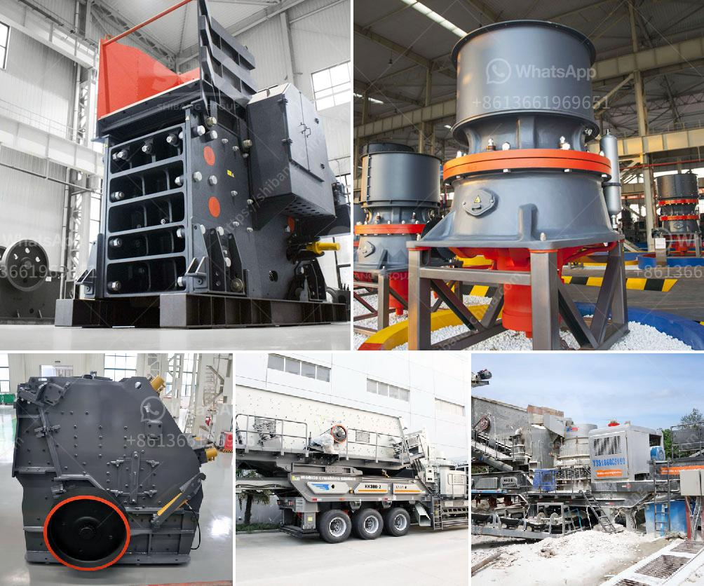

<h3>stone crusher aggregate supplier kota</h3>
The growing demand for crushed stones in various industries is prompting the need for a reliable and efficient stone crusher aggregate supplier in Kota. In recent years, infrastructure development projects have been on the rise in Kota and the surrounding areas. As a result, the demand for raw materials such as sand, stone chips, and aggregates has increased significantly.

A stone crusher aggregate supplier plays a vital role in delivering aggregates for various construction projects. Whether it's for road construction, dams, or buildings, aggregates are essential in providing strength to the structures. Stone crushers are machines used to reduce the size of rocks into smaller pieces or gravel for specific applications.

One such stone crusher aggregate supplier in Kota is Shri Narendra Tiwari. He is a reputed supplier known for his quality products and timely delivery. With years of experience in the industry, Shri Narendra Tiwari understands the requirements and demands of his customers.

As a stone crusher aggregate supplier, Shri Narendra Tiwari sources his raw materials from trusted quarries to ensure their quality. He offers a wide range of aggregates, including 20 mm stone aggregate, 10 mm stone aggregate, 40 mm stone aggregate, and stone dust. These aggregates are available in various quantities to cater to different project needs.

Shri Narendra Tiwari's stone crusher aggregate supplier business follows a strict quality control process. The raw materials are thoroughly inspected before being crushed, ensuring that only the best quality aggregates are supplied to the customers. The crushing process is executed using modern machinery and equipment to maintain the desired consistency and quality of the aggregates.

Apart from the quality of the aggregates, customer satisfaction is also of utmost importance to Shri Narendra Tiwari. He believes in building long-term relationships with his customers and providing them with personalized services. His team of professionals is well-trained and knowledgeable, addressing the customers' queries and needs promptly.

Another factor that sets Shri Narendra Tiwari apart from other stone crusher aggregate suppliers in Kota is his competitive pricing. He aims to provide cost-effective solutions without compromising on the quality of the aggregates. This makes him a preferred supplier among contractors and builders in the region.

In conclusion, having a reliable stone crusher aggregate supplier in Kota like Shri Narendra Tiwari is crucial for meeting the growing demand for aggregates in the construction industry. He offers a wide range of aggregates with strict quality control measures, ensuring customer satisfaction. With his competitive pricing and personalized services, Shri Narendra Tiwari has earned a reputable position in the market. So, if you're in need of quality aggregates for your construction projects in Kota, look no further than Shri Narendra Tiwari, the trusted stone crusher aggregate supplier in the region.
<h3>Contact us</h3><ul><li><strong>Whatsapp:&nbsp;<a href="https://wa.me/8613661969651">+8613661969651</a></strong></li><li><a href="https://swt.shibang-china.com/?git&amp;zhl&amp;stone crusher aggregate supplier kota"><strong>Online Service(chat now)</strong></a></li></ul><h3>Related</h3><ul><li><a href='buy gold crusher machine.md'>buy gold crusher machine</a></li><li><a href='agen jaw crusher kenya.md'>agen jaw crusher kenya</a></li><li><a href='machinery required to setup cement plant.md'>machinery required to setup cement plant</a></li><li><a href='hammer mill dealer in cebu.md'>hammer mill dealer in cebu</a></li><li><a href='rock crusher used in mining and quarry for sale.md'>rock crusher used in mining and quarry for sale</a></li></ul>