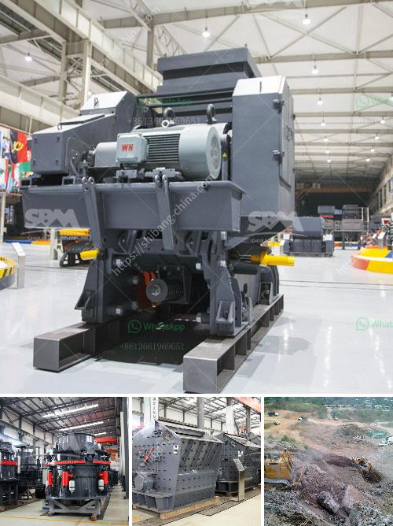

<h3>stone crusher bahan bakar</h3>
A stone crusher is a machine used to convert large stones into smaller sizes that can be used in construction or other purposes. There are several types of stone crushing machines, which are differentiated based on the stone processing stages, namely primary crusher, secondary crusher, and tertiary crusher.

Stone crushers are powered by various fuel types, including gasoline, diesel, or electricity. However, in recent years, there has been a shift towards using crushers powered by biodiesel. This alternative fuel source, also known as a bahan bakar nabati, offers several advantages for stone crushers.

Firstly, bahan bakar nabati is a more environmentally friendly option compared to traditional fossil fuels. Biodiesel is derived from renewable resources such as vegetable oils, animal fats, or recycled cooking oil. When burned, it produces lower emissions of greenhouse gases and reduces air pollution. This is particularly important in the construction industry, where stone crushers are often operated in densely populated areas.

Additionally, bahan bakar nabati provides a more sustainable fuel source. As the demand for stone crushers continues to rise, the need for fuel also increases. Traditional fossil fuels, such as gasoline and diesel, are finite resources that contribute to environmental degradation and climate change. By utilizing biodiesel, stone crusher operators can reduce their reliance on non-renewable energy sources and contribute to a more sustainable future.

Furthermore, bahan bakar nabati can offer cost savings for stone crusher operators. As the price of fossil fuels continues to fluctuate, biodiesel has become a more cost-effective option. Additionally, governments in many countries provide incentives and subsidies for using renewable energy sources, including biodiesel. This can lower the operational costs for stone crusher operators and make their businesses more profitable.

In conclusion, stone crushers powered by bahan bakar nabati offer several advantages for operators, the environment, and sustainability. With lower emissions, renewable resource utilization, and potential cost savings, there are compelling reasons for stone crusher operators to switch to biodiesel. As the world continues to prioritize environmental protection and sustainable practices, embracing alternative fuel sources like bahan bakar nabati is a step in the right direction.
<h3>Contact us</h3><ul><li><strong>Whatsapp:&nbsp;<a href="https://wa.me/8613661969651">+8613661969651</a></strong></li><li><a href="https://swt.shibang-china.com/?git&amp;zhl&amp;stone crusher bahan bakar"><strong>Online Service(chat now)</strong></a></li></ul><h3>Related</h3><ul><li><a href='grinding machine for bentonite.md'>grinding machine for bentonite</a></li><li><a href='sewa rental stone crusher.md'>sewa rental stone crusher</a></li><li><a href='cone crusher from china.md'>cone crusher from china</a></li><li><a href='mobile coal jaw crusher provider in south africa.md'>mobile coal jaw crusher provider in south africa</a></li><li><a href='price of plant crusher in nigeria.md'>price of plant crusher in nigeria</a></li></ul>