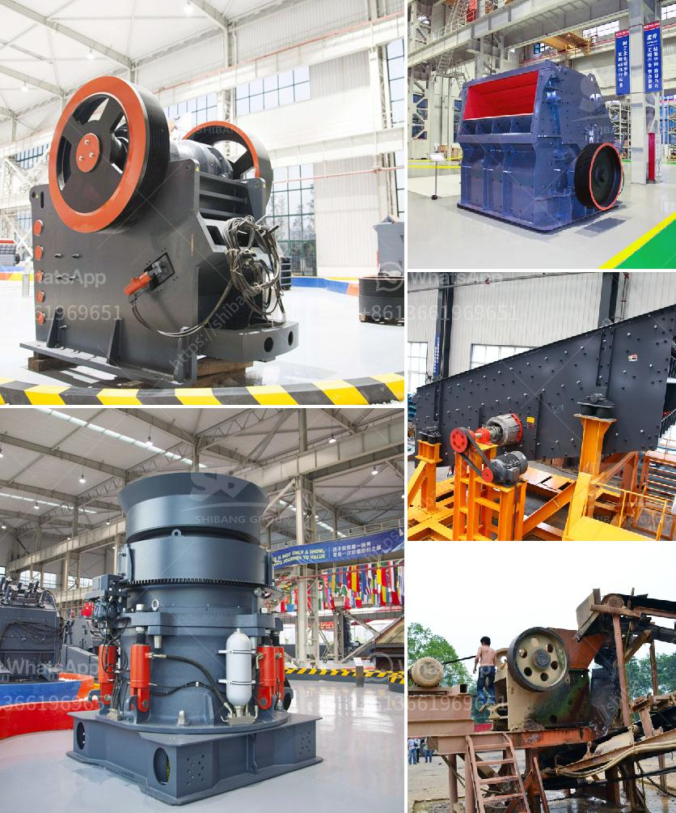

<h3>stone crusher contact</h3>
What could be more irritating than not being able to reach someone in crucial times? In today’s market of various choices, it is essential for businesses to provide options that are accessible to their clients. Can you imagine being stuck in a situation where you urgently needed a stone crusher, yet you couldn’t contact a reliable supplier to get one? It would be an absolute nightmare!

A stone crusher is a machine used to convert large stones into smaller sizes that can be used in construction or other purposes. There are several types of stone crushing machines, which are differentiated based on the stone processing stages, namely primary crusher, secondary crusher and tertiary crusher. Each type of stone crusher has a different function with different processing results.

On one hand, the stone crusher is used to crush crushed materials into the required size for further processing. One the other hand, the crushed stone can be transported by the conveyor belt to the sand making machine for fine crushing. The crushed material is then transformed into manufactured sand, as well as a mixture of concrete aggregate.

In order to ensure smooth operations, it is essential for stone crusher contacts to be available at any given moment. Whether it may be for purchasing inquiries or technical support, having a reliable stone crusher contact can be advantageous for potential buyers or current customers. The contact provides an avenue for clients to have any issue addressed immediately or to have their questions answered promptly, allowing a hassle-free customer experience.

A reliable stone crusher contact is not only vital for business purposes, but also for the peace of mind of those who are looking to purchase or rent a stone crusher machine or plant. As a buyer or renter, it is important to know that the contact person will be responsive to your inquiries and able to address any potential problems that may arise. Without an accessible stone crusher contact, it becomes challenging for clients to find the necessary support they need, leading to frustration and potentially lost business.

Moreover, a stone crusher contact can help potential buyers navigate through the various options available in the market. With multiple suppliers and models to choose from, having a knowledgeable contact person can make a significant difference in the decision-making process. They can provide information about different stone crusher models, their features, and advantages, helping buyers make an informed choice.

In conclusion, the significance of having a reliable stone crusher contact cannot be emphasized enough. It is crucial for businesses to ensure that their contacts are easily accessible, responsive, and informative. A stone crusher contact not only improves customer satisfaction but also increases the likelihood of business success. So, whether you are a potential buyer or a stone crusher supplier, make sure to establish a strong and efficient contact system for the benefit of both parties involved.
<h3>Contact us</h3><ul><li><strong>Whatsapp:&nbsp;<a href="https://wa.me/8613661969651">+8613661969651</a></strong></li><li><a href="https://swt.shibang-china.com/?git&amp;zhl&amp;stone crusher contact"><strong>Online Service(chat now)</strong></a></li></ul><h3>Related</h3><ul><li><a href='cement grinding ball mill process.md'>cement grinding ball mill process</a></li><li><a href='clay crusher machine for refractories.md'>clay crusher machine for refractories</a></li><li><a href='different types of roller milling.md'>different types of roller milling</a></li><li><a href='i want to buy a quarry machine nigeria.md'>i want to buy a quarry machine nigeria</a></li><li><a href='mobile rock crusher bend oregon.md'>mobile rock crusher bend oregon</a></li></ul>