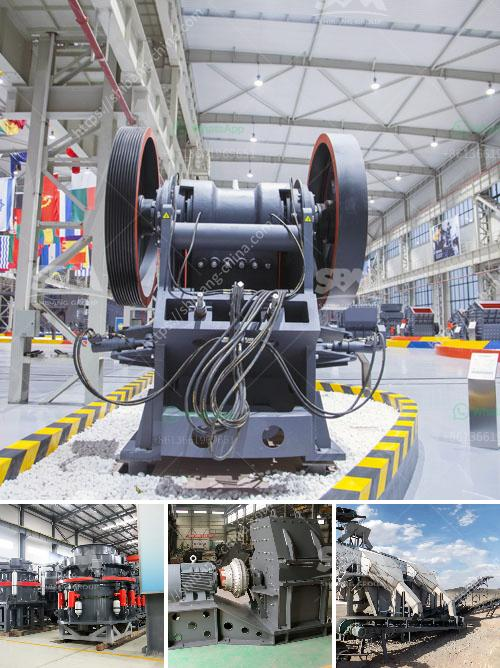

<h3>stone crusher dubai for sale</h3>
Stone crusher is a machine used to crush rocks into smaller pieces, usually for gravel or some other road or building application. Most rock crushers have a hopper at the top, a container which holds the rock above the crusher and uses gravity to feed it in. Alternately, rock crushers can use a belt drive to continuously transport the rock into the crusher.

At present, there are numerous crushers on the market in Dubai. However, customers might be confused about the quality and the price of them. People who have been in this industry for a long time might have some basic knowledge of crusher machine, but for those who are new to this industry, even if they are knowledgeable about stone crushers, they still have no idea about stone crusher Dubai for sale.

Therefore, let me introduce the stone crusher Dubai for sale briefly. The stone crusher Dubai for sale includes PE jaw crusher, PF impact crusher, hammer crusher, gyratory crusher, cone crusher and mobile crushing plant, etc. These machines are widely used in mining, metallurgy, chemical, electric power, coal, building materials, ceramics, grinding wheel manufacturing industry and so on.

According to the different types of crushers, they can be divided into primary crusher, secondary crusher, and fine crusher. Primary crusher processes more than one hundred and fifty kinds of stones such as granite, basalt, limestone, rock, concrete, aggregate, gravel, dolomite and quartz. It is suitable for primary, secondary and tertiary crushing of middle hard and soft rock such as limestone, dolomite, marl,sandstone and clinker, etc.

As for secondary crusher, gyratory crusher is more suitable. The rocks crushing production line usually includes primary crushing process and the secondary crushing stage. The stone materials from the quarry are firstly sent to the primary crusher by vibrating feeder for primary crushing, and then the secondary crushing is completed by the gyratory crusher.

In conclusion, stone crushers are a good investment. They are the future of the construction industry and are facing a strong competitive market. You can choose one according to your own needs and the capacity of your stone crusher plant.
<h3>Contact us</h3><ul><li><strong>Whatsapp:&nbsp;<a href="https://wa.me/8613661969651">+8613661969651</a></strong></li><li><a href="https://swt.shibang-china.com/?git&amp;zhl&amp;stone crusher dubai for sale"><strong>Online Service(chat now)</strong></a></li></ul><h3>Related</h3><ul><li><a href='cost of cement factory setup.md'>cost of cement factory setup</a></li><li><a href='used vertical ball mill 200tph capacity.md'>used vertical ball mill 200tph capacity</a></li><li><a href='dolomite powder plant.md'>dolomite powder plant</a></li><li><a href='bush crusher machine.md'>bush crusher machine</a></li><li><a href='bazer stone crusher.md'>bazer stone crusher</a></li></ul>