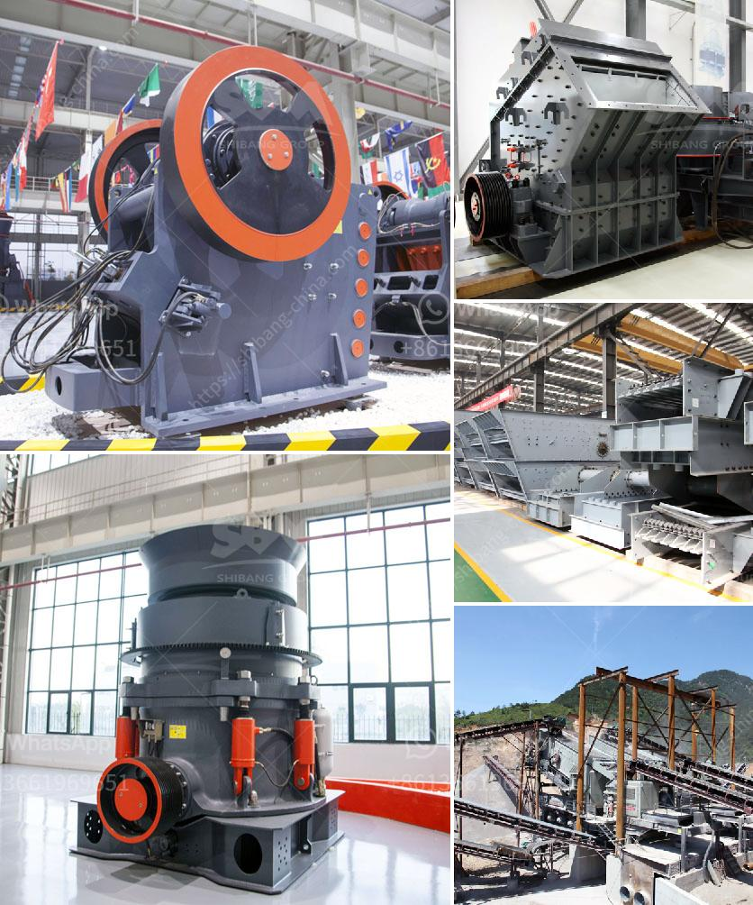

<h3>stone crusher ethiopia</h3>
Ethiopia, the land of Oppurtunity, a target for many investors. Known for its fertile land, abundant natural resources, and a population of over 100 million people, Ethiopia is one of the fastest-growing economies in Africa. The country has undergone significant industrial growth in recent years, which has led to an increase in infrastructure development.

One area of investment that has caught the attention of both local and foreign investors is the stone crushing business. Stone crushing is a massive industry in Ethiopia, with the government allocating a considerable budget for its development in the country. The sector provides employment opportunities to over 500,000 people directly and indirectly.

The stone crushing industry is also a source of high foreign exchange earnings. The country exports its products, such as crushed stones, to neighboring countries like Djibouti and Sudan. In addition, the industry contributes to the country's sustainable development by providing raw materials for the construction of roads, buildings, and other infrastructure projects.

Why is stone crushing in Ethiopia so attractive for investors? Firstly, the country has vast reserves of natural stones, such as granite, limestone, quartzite, and marble. These stones can be easily extracted from their natural state and processed into high-quality aggregates.

Secondly, Ethiopia's strategic location enables it to export its products to various markets easily. The country boasts excellent transport and logistics infrastructure, including road networks, railways, and ports, making it a hub for regional trade.

Furthermore, the stone crushing industry in Ethiopia is highly supported by the government. The government has allocated a substantial budget for infrastructure development, including the construction of roads, bridges, and buildings. The growth in infrastructure creates a huge demand for aggregate materials, which drives the stone crushing industry forward.

In addition to the favorable government policies and infrastructure development, investors are lured by the low labor costs and high return on investment in the stone crushing sector in Ethiopia. The availability of cheap labor resources allows investors to hire a large number of workers at affordable wages, reducing production costs and maximizing profits.

However, despite the lucrative prospects, the stone crushing industry in Ethiopia faces some challenges. The lack of modern technology and appropriate mining techniques in the country hampers productivity and efficiency. This issue can be addressed by encouraging more foreign investment, which can bring in advanced machinery and training for the local workforce.

Moreover, environmental concerns surrounding stone crushing activities need to be addressed. Unregulated quarries and crushers can harm the environment, lead to deforestation, and pose health risks to nearby communities. The government needs to enforce strict regulations and provide guidance on sustainable and environmentally friendly practices in the stone crushing industry.

In conclusion, stone crushing in Ethiopia is an attractive investment opportunity with vast potential for growth. The country has abundant reserves of natural stones, a favorable investment climate, and strong government support. However, addressing challenges such as technological advancement and environmental sustainability is crucial for the sustainable development of the sector. With the right strategies and initiatives, Ethiopia's stone crushing industry can contribute significantly to its economic growth while preserving its natural resources and protecting the environment.
<h3>Contact us</h3><ul><li><strong>Whatsapp:&nbsp;<a href="https://wa.me/8613661969651">+8613661969651</a></strong></li><li><a href="https://swt.shibang-china.com/?git&amp;zhl&amp;stone crusher ethiopia"><strong>Online Service(chat now)</strong></a></li></ul><h3>Related</h3><ul><li><a href='diagram of a typical hammer mill.md'>diagram of a typical hammer mill</a></li><li><a href='manganese ore concentrate south africa.md'>manganese ore concentrate south africa</a></li><li><a href='indopol roller grinding mills.md'>indopol roller grinding mills</a></li><li><a href='gold milling licence in zimbabwe.md'>gold milling licence in zimbabwe</a></li><li><a href='equipment for ferro manganese plant.md'>equipment for ferro manganese plant</a></li></ul>