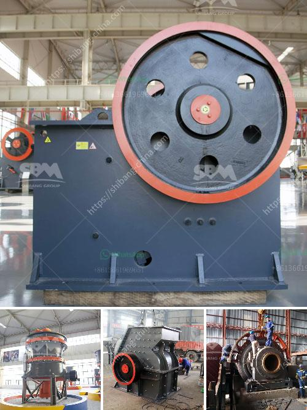

<h3>stone crusher for road construction</h3>
Stone crushing is an important part in the construction industry and building materials industry. It is widely used in various sectors like mineral processing, construction, cement, as well as road construction. Due to its wide application, the stone crusher machine has become the necessary equipment in the road construction field.

One of the most important materials required for any construction project is aggregate. Aggregate is a broad category of coarse particulate material used in construction, including sand, gravel, crushed stone, slag, recycled concrete, and geosynthetic aggregates. Aggregates are the most mined materials in the world and are essential in creating concrete and asphalt.

Stone crushers are widely used in the mining, smelting, building materials, highways, railways, water conservancy, and chemical industries. Choosing a reliable stone crusher machine manufacturer is an important prerequisite for investors.

In the past, many regions have seen a decline in their infrastructure, such as roads, bridges, tunnels, and expressways. However, with the rapid development of the country's economy, there is an urgent need for infrastructure construction that can improve the overall urbanization level. In particular, road construction is essential in enhancing transportation accessibility between cities and villages.

A stone crusher is a machine used to convert large-sized rocks into smaller-sized rocks, gravel, or rock dust. Crushers are used to reduce the size or change the form of waste materials, so they can be more easily disposed of or recycled.

Stone crushers are designed to handle a wide range of crushing applications from primary, secondary, and tertiary hard rock crushing to mixed demolition debris, crushed or broken concrete and asphalt, sand, gravel and quarried stone.

Asphalt and concrete are two of the most popular materials used for road construction purposes. Asphalt is widely preferred due to its flexibility, durability, and cost-effectiveness. However, it requires the use of crushed stone aggregate as a base material. Crushed stone aggregates are essential in the construction of roads, bridges, tunnels, airports, and railways.

Stone crushers play a vital role in the production of aggregates. They provide the foundation for construction, as they provide the necessary road metal, which is an essential raw material for road construction as well as building construction.

Stone crushers can be classified into various categories depending on their size. These are primarily used for medium and large-scale construction projects. For small-scale construction projects, stone crushers can be classified into small, medium, and large-sized crushers based on their output capacity.

There are many advantages of using a stone crusher machine for road construction. The crushing ratio is large, the crushing efficiency is high, the maintenance cost is low, and the operation is simple and reliable. It ensures the continuous and stable operation of the equipment, and produces high-quality finished materials with uniform particle size.

In conclusion, stone crushers are essential equipment in road construction. Today, there are different types of stone crushers available in the market, making it easy to choose one that fits your specific needs. The market is full of capable stone crushers, each with their own unique set of benefits. Research and choose one that best suits your needs, and experience a smoother and more efficient construction process.
<h3>Contact us</h3><ul><li><strong>Whatsapp:&nbsp;<a href="https://wa.me/8613661969651">+8613661969651</a></strong></li><li><a href="https://swt.shibang-china.com/?git&amp;zhl&amp;stone crusher for road construction"><strong>Online Service(chat now)</strong></a></li></ul><h3>Related</h3><ul><li><a href='vertical roller mill in cement plant.md'>vertical roller mill in cement plant</a></li><li><a href='bentonite pulverizer.md'>bentonite pulverizer</a></li><li><a href='mobile crushers for sale.md'>mobile crushers for sale</a></li><li><a href='quarry crusher machine equipment in germany prices.md'>quarry crusher machine equipment in germany prices</a></li><li><a href='used ball milling machine for sale canada.md'>used ball milling machine for sale canada</a></li></ul>