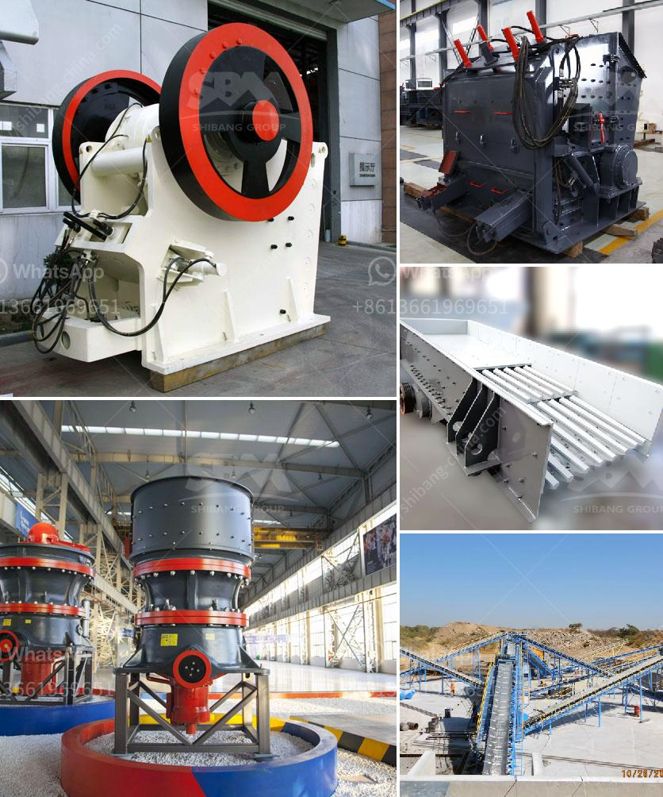

<h3>stone crusher for sale in south africa</h3>
Stone crushers are widely used in metallurgy, building materials, chemicals, mining and other industries. They are used to reduce the size of large rocks and ores into smaller pieces and granules. Stone crushers are highly efficient and perform at high capacity with low energy consumption.

Stone crushers are capable of crushing a large variety of materials, including stones such as granite, limestone, gravel, and more. Stone crushers are widely used in the mining, smelting, construction materials, highway, railway, water conservancy, and chemical industries. Stone crushers have the ability to break down large rocks into smaller manageable pieces, making them easier to transport and work with.

There are many types of stone crushers available for sale in South Africa. These include Jaw crushers, Cone crushers, Impact crushers, and Hammer crushers. These different types of crushers can be used in a variety of applications that range from hard stone and concrete to softer minerals like iron ore and limestone.

Stone crushers are classified based on the size of the stone they crush. Jaw crushers have a fixed jaw and a moving jaw. The material is fed into the chamber between the jaws, where it is crushed to a smaller size. Cone crushers utilize a gyrating spindle to crush the materials. The material is crushed between a fixed outer cone and a rotating mantle. Impact crushers use impact force to crush materials. The material is fed into a chamber and strikes the rotating blow bars, breaking it into smaller pieces. Hammer crushers use a series of rotating hammers to crush material. The material is fed into a chamber and struck by the rotating hammers until it breaks into smaller pieces.

Stone crushers in South Africa are available for sale in different sizes and capacities. Depending on the production requirements, there is a large variety of stone crushers available for sale. Some models are capable of crushing 300 tons of stones per hour, while others can achieve crushing capacities of up to 500 tons per hour.

Stone crushers have many features and benefits, making them valuable investments for businesses. They are reliable, efficient, and durable machines that can handle even the toughest materials. Stone crushers require minimal maintenance and are easy to operate, reducing downtime and increasing productivity.

Stone crushers for sale in South Africa are available at competitive prices, making them an attractive option for businesses that want to invest in crushing equipment. For more information about the stone crusher for sale in South Africa, please feel free to contact us.
<h3>Contact us</h3><ul><li><strong>Whatsapp:&nbsp;<a href="https://wa.me/8613661969651">+8613661969651</a></strong></li><li><a href="https://swt.shibang-china.com/?git&amp;zhl&amp;stone crusher for sale in south africa"><strong>Online Service(chat now)</strong></a></li></ul><h3>Related</h3><ul><li><a href='nigeria cone crusher photos.md'>nigeria cone crusher photos</a></li><li><a href='hydraulic control for jaw crusher.md'>hydraulic control for jaw crusher</a></li><li><a href='manufacturer of ball mill india.md'>manufacturer of ball mill india</a></li><li><a href='quartz stone crusher.md'>quartz stone crusher</a></li><li><a href='manufacturer of crushing equipment philippines.md'>manufacturer of crushing equipment philippines</a></li></ul>